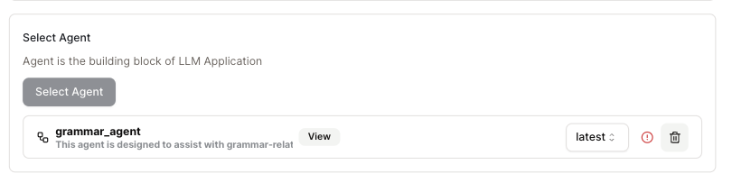
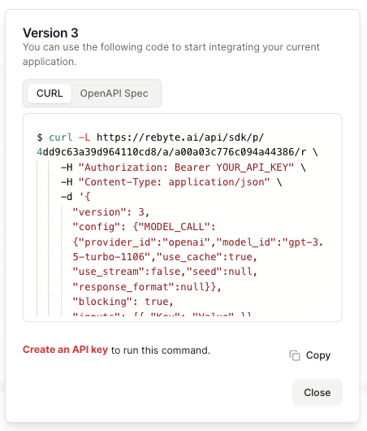
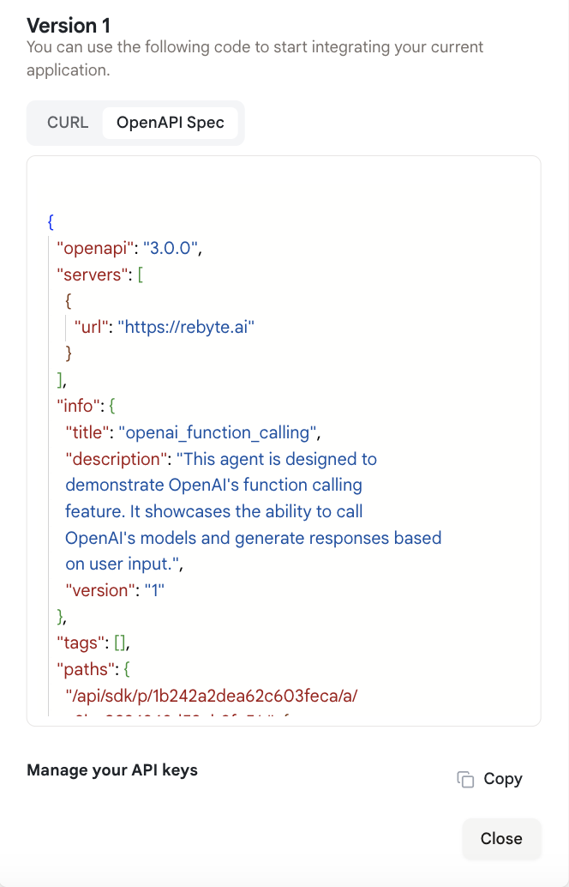
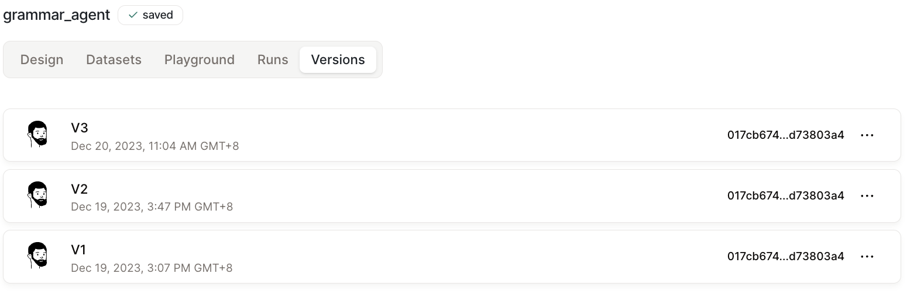

# Publish Your Agent

Once you have finished designing and testing your agent, click "Deploy" to publish a new version or checkout the current version.

* After deploying your agent, you can use it to create your ReByte app.

<figure></figure>

* You can use the "CURL" to integrate it into your own applications.

<figure></figure>

* You can also integrate your agent into building OpenAI's GPTs using the "OpenAPI Spec". For more details, see [here](../apps/openai-gpts-with-ai-agent/chat-with-notion.md).

<figure></figure>

* To check the different versions you've already published, click the "Versions" tab.

<figure></figure>
