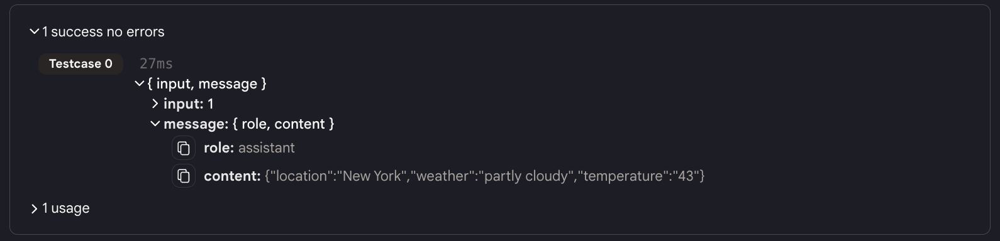
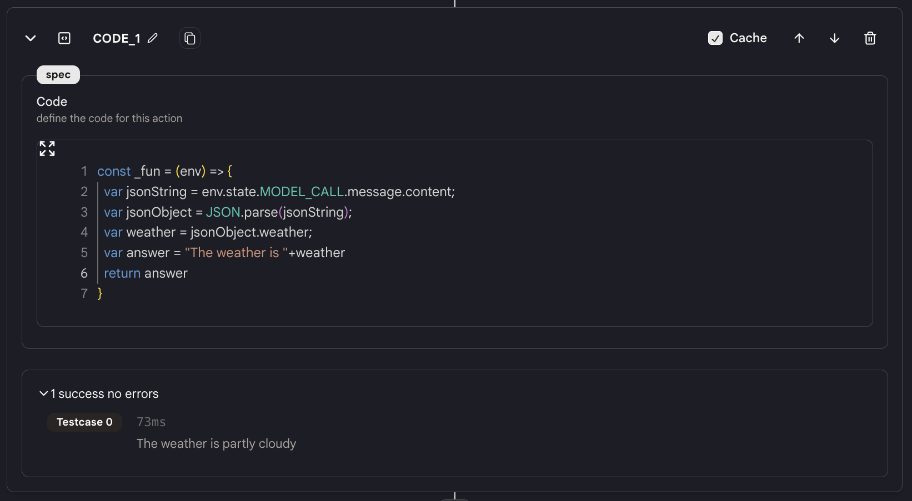
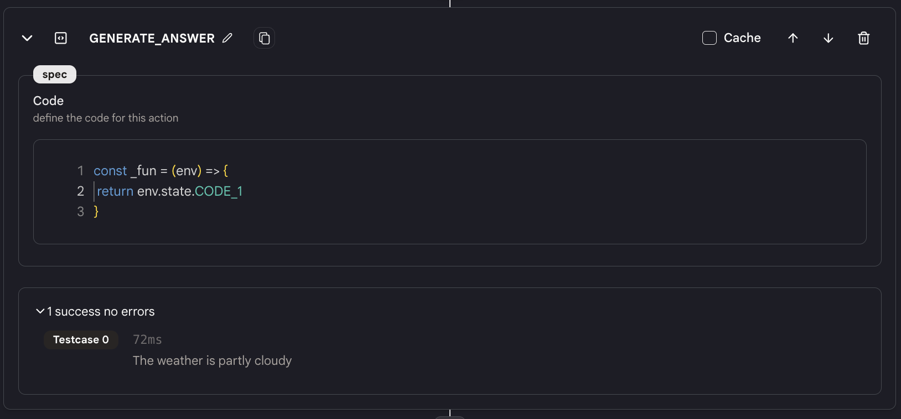

# コード

`Code` アクションは非常に頻繁に使用されるアクションです。これにより、前のアクションからのデータを任意の方法で処理するための Javascript コードを書くことができます。

## 使用方法

**一般的な使用方法**

- `Code` アクションを使用するには、まずツールに `Code` アクションを追加します。

- 前のアクションからのデータを処理し、次のアクションにデータを送信するための任意の Javascript コードをここに書きます。

**キャッシュ**

- `Code` アクションの右上にキャッシュボタンがあります。これをオンにすると、結果がキャッシュされます。`Code` アクションの入力とコードが同じであれば、結果はキャッシュから直接返されます。これにより、ツールのパフォーマンスが大幅に向上します。

## 例

<figure></figure>

- 例えば、`MODEL_CALL` アクションが次のような JSON 文字列を含むメッセージを返す場合：`"{"location":"New York","weather":"partly cloudy","temperature":"43"}"`。

- そして、この JSON から "weather" フィールドを取得したい場合、`Code` アクション（"CODE_1"と名付ける）を追加し、次のコードを書きます：

```javascript
const _fun = (env) => {
  var jsonString = env.state.MODEL_CALL.message.content;
  var jsonObject = JSON.parse(jsonString);
  var weather = jsonObject.weather;
  return weather;
};
```

<figure></figure>

- これで、{{CODE_1}} または env.state.CODE_1 を使用して「weather」フィールドの値を取得できます。

<figure></figure>

<!-- ## ツールの例

上記の例で示されたコードは、以下のツールで見つけることができます。

[コードアクション](https://rebyte.ai/p/21b2295005587a5375d8/callable/4929456b3b6bfcee316d/editor)

ご不明点がありましたら、お知らせください。 -->
