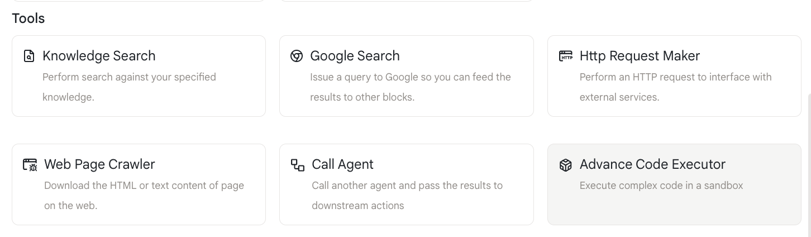
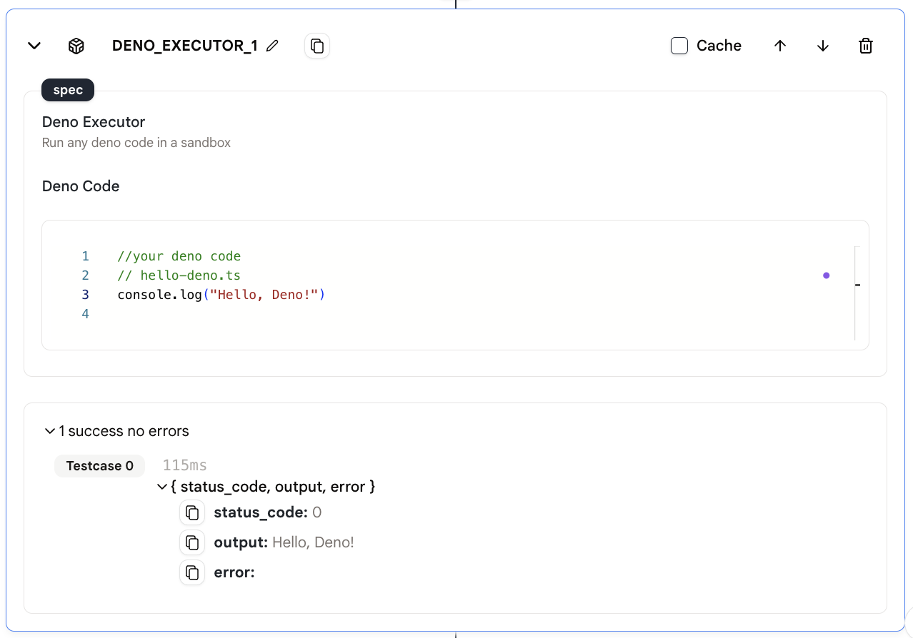

# 高度なコード実行

私たちはサンドボックスでコードを実行するための「高度なコード実行」アクションを提供しています。

## 使用方法

- エージェントに「高度なコード実行」アクションを追加します。

<figure></figure>

- 「Deno コード」に実行したいコードを入力します。コードを直接入力するか、他のアクションの出力を参照することができます。

- **注意:** 必ず JavaScript または TypeScript のコードを入力してください。

<figure></figure>

## 出力

このアクションの出力は、上記に示されているコードの実行結果です。
