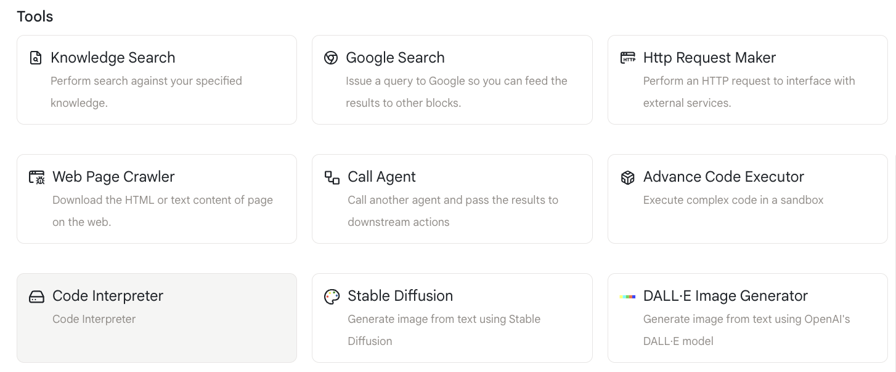
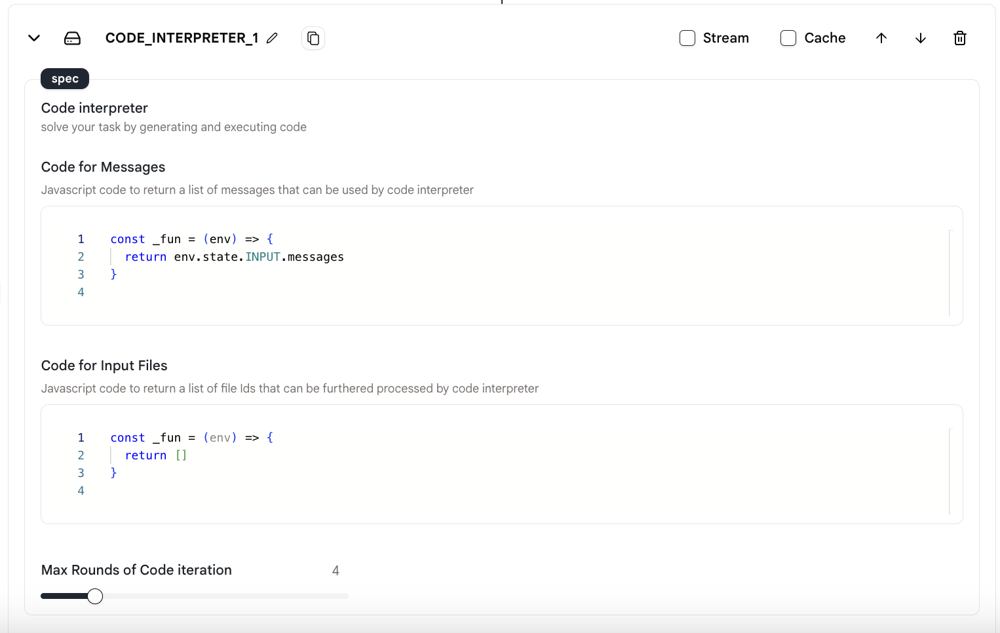
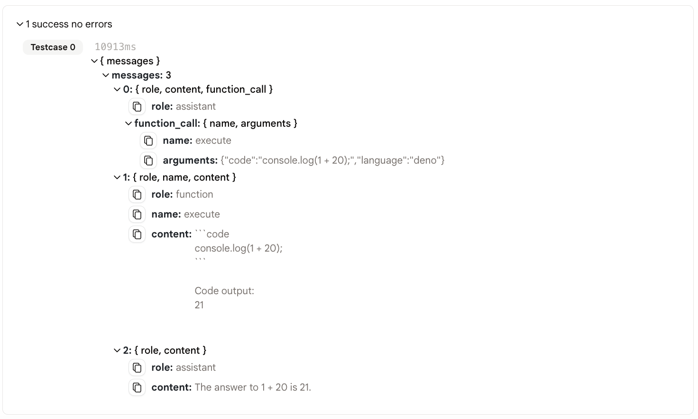

# コードインタープリター

私たちは、コードを生成して実行することでタスクを解決するための「コードインタープリター」アクションを提供しています。

## 使用方法

- エージェントに「コードインタープリター」アクションを追加します。

<figure></figure>

- 「メッセージ用コード」に「コードインタープリター」アクションへの入力します。

<figure></figure>

- 「コードの最大反復回数」を設定して、コードインタープリターからのメッセージ数を制限します。

## 出力

このアクションの出力は以下の通りです：

<figure></figure>
