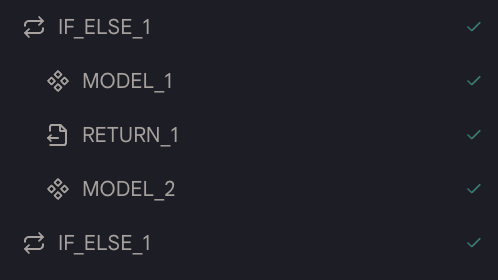

# Early Return

このアクションを使用すると、ツール内の他のアクションを実行せずに結果を早期に返すことができます。これは、他のアクションを実行せずに結果を早期に返したい場合に非常に便利です。

## 使用方法

- このアクションには特に設定する必要はありません。早期にリターンしたい場所に追加するだけです。

- 通常、このアクションは`If Else`アクションで使用されます。例えば、`If`ブロックに`Early Return`アクションを追加すると、条件が真の場合、システムは結果を早期に返します。そうでない場合、システムは`If`ブロック内のアクションをスキップし、他のアクションを続行します。

<figure></figure>

## エージェントの例

<!-- [早期リターン](https://rebyte.ai/p/21b2295005587a5375d8/callable/6b342c4a4042ccc17e58/editor#3) -->
