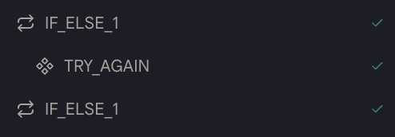
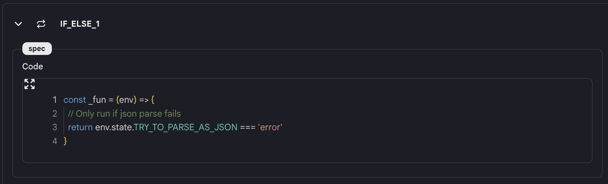

# If Else（条件分岐）

`If Else`アクションを使用すると、条件に基づいてアクションを実行できます。

## 使用方法

- ツールに`If Else`アクションを追加すると、同じ名前の 2 つのブロック（例えば「IF_ELSE_1」）がアクションに追加されます。

<figure></figure>

- 条件を JavaScript 形式で入力します。この関数はブール値を返す必要があります。

<figure></figure>

- 実行中にシステムは条件が真かどうかを判断します。もし条件が真であれば、最初の`If_Else`ブロックと 2 番目の`If_Else`ブロックの間のアクションが実行されます。そうでない場合、実行は 2 番目の`If_Else`ブロックの後にジャンプします。

- **注意**: `If Else`アクションの結果は配列です。`env.state.LOOP_1[0]`や`{{LOOP_1[0]}}`のような形式を使用してください。

<!-- ## ツールの例

* [If Else ツール](https://rebyte.ai/p/21b2295005587a5375d8/callable/f6f55d6029c8a0aedd53/editor) -->
