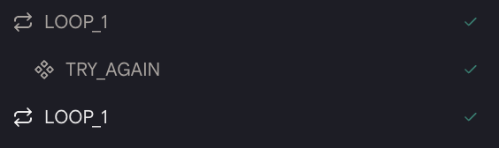

# ループ

この `Loop Until` アクションを使用すると、条件が真の間、アクションを繰り返し実行できます。

## 使い方

- 最初に `Loop Until` アクションを作成すると、2 つの「ループ」ブロックが作成されます。

<figure></figure>

- JavaScript 形式の条件を入力します。この関数はブール値を返す必要があります。

- 最大反復回数を設定することもできます。反復回数が最大反復回数に達すると、条件が依然として真であってもループは停止します。

<figure></figure>

- 次に、ループ内で実行したいアクションを追加します。

- 実行中、システムは条件が真かどうかを判断します。条件が真であれば、2 つのループブロックの間にあるアクションが条件が偽になるまで実行されます。それ以外の場合、実行は 2 番目のループブロックの後にジャンプします。

- **注意**: 「ループ」アクションの結果は配列です。 `env.state.LOOP_1[0]` や `{{LOOP_1[0]}}` のような形式を使用することを確認してください。

<!-- ## 例

- [ループ Until](https://rebyte.ai/p/21b2295005587a5375d8/callable/0029ec181e52a9fc2bc3/editor) -->
