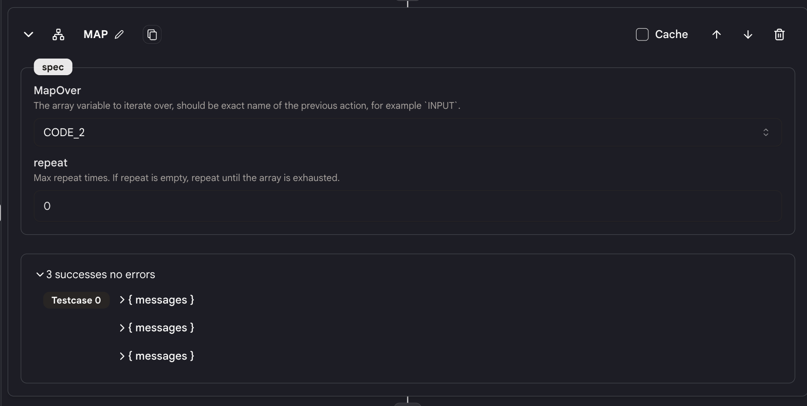

# Map Reduce

`Map Reduce` アクションを使用すると、配列をマップしてアクションのシーケンスを並行して実行できます。

これは、複数のウェブページを同時にスクレイピングする場合などに便利です。

## 使い方

- ツールに `Map Reduce` アクションを追加すると、2 つの同じ名前のブロック（例：「MAP_REDUCE_1」）がアクションに追加されます。

- 2 つのブロック間に追加されたアクションは、配列内の各要素に対して並行して実行されます。

<figure></figure>

- `Map Reduce` アクションに対して以下の仕様を設定します。

### 仕様

<figure></figure>

**MapOver**

- 前のアクションを選択し、このアクションの出力に対してマップを行います。
- 前のアクションの出力は配列でなければなりません。また、その配列が空でないことを確認してください。

**Repeat**

- この値は最大反復回数を指定します。
- 「repeat」値が指定されていない場合、配列が終了するまで繰り返しが続きます。ハードリミットは 64 回の繰り返しです。
- 「repeat」値が指定されている場合、配列が終了するか、繰り返し回数がリピート値に達するまでのいずれか早い方で停止します。

### 出力

- map-reduce アクション内の各アクションは、値の配列を出力します。
