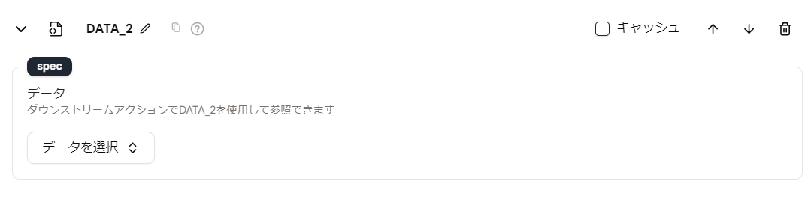

# データセットローダー

`Dataset Loader`アクションを使用すると、エージェントのデータセットからデータをロードできます。ロードしたデータは、後続のアクションで使用することができます。

## 使用方法

- エージェントに`Dataset Loader`アクションを追加し、ロードしたいデータセットを選択します。
- このデータは、後続のアクションでデータセット名を使用して参照できます。例えば、`{{DATA_2}}` のように使用します。

<figure></figure>

<!-- ## エージェントの例

<!-- 使用方法を理解するための例となるエージェントを提供します。 -->

- [データセットローダー](https://rebyte.ai/p/21b2295005587a5375d8/callable/fa56c8cf3f2080ef08d4/editor) -->
