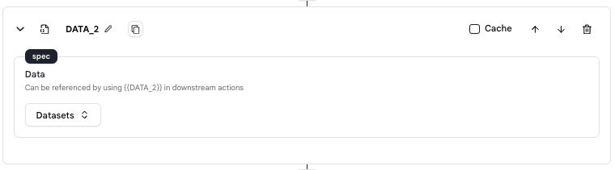

# Dataset Loader

The `Dataset Loader` action allows you to load data from the agent's datasets. The data can be used in subsequent actions.

## Usage

* Add a `Dataset Loader` action to your agent and select the dataset you want to load from.

* Refer to this data by using the dataset's name, like: `{{DATA_2}}` in downstream actions.

<figure></figure>

## Example Tool

<!-- We provide example tools to help you understand the usage of actions. -->

* [Dataset Loader](https://rebyte.ai/p/21b2295005587a5375d8/callable/fa56c8cf3f2080ef08d4/editor)
