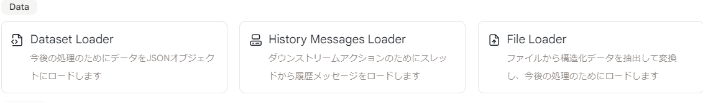
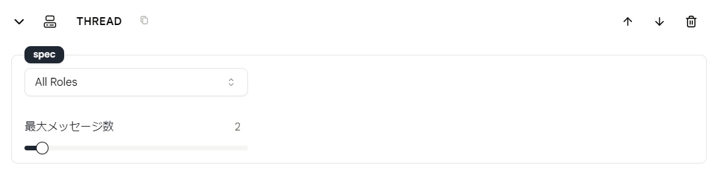

# History Messages Loader

このアクションを使用すると、ツールを使用する際に、「スレッド」に記憶される過去のメッセージの数を設定できます。これらのメッセージは、このツールを使用して新しいメッセージを受信するたびに、大規模言語モデルに送信されます。

ツールが新しいメッセージを受信するたびに、「スレッド」は新しいメッセージでを更新し、対応する過去のメッセージの数が内容として追加され、大規模言語モデルに送信されます。

## 使用方法

- ツールに`History Messages Loader`アクションを追加します。

<figure></figure>
  
* 「スレッド」に記憶されるメッセージの数を指定します。

<figure></figure>

- 「スレッド」に記憶されるメッセージの数は、大規模言語モデルのパフォーマンスに影響を与えます。
- 記憶されるメッセージが多いほど、大規模言語モデルが得られるコンテキストが多くなりますが、これにより大規模言語モデルの応答時間が増加します。
