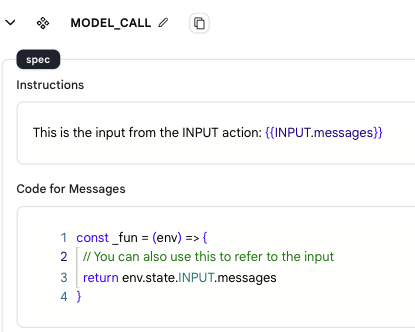

# Input


* The `Input Action` is used to send input information to the Agent. Other actions are based on the input information to perform the right operation.

* The first action in the Agent must be an `Input Action`, you can not delete it or copy it.

* You can select different input datasets to run your agent.

## Usage

You can use the input by using the `{{INPUT.message}}` variable in the instructions or `env.state.INPUT.messages` in the code editor.

<figure></figure>

## Data Format

* When used in agent page, the input is extracted from the predefined datasets.

* When connected to Apps, the input is from the app user's input and conversation history. By default, We will put the last 10 messages to the agent.

* The input data format is as follows:

    ```json
    {
    "messages":[{
            "role": "user",
            "content": "The content."
        },
        {
            "role": "assistant",
            "content": "The content."
        }]
    }
    ```

<!-- ### Parameters

- Input type
    - Select from predefined Datasets
    - When connecting to Chat, the latest 10 history dialogues will be sent to the Agent as input information by default, formatted as follows
    
    ```json
    {
    "Messages":[
    {
        "role": "user",
        "content": "The content."
    },
    {
        "role": "assistant",
        "content": "The content."
    }
    ]
    }
    ```
    - output
        - Output the correct data -->