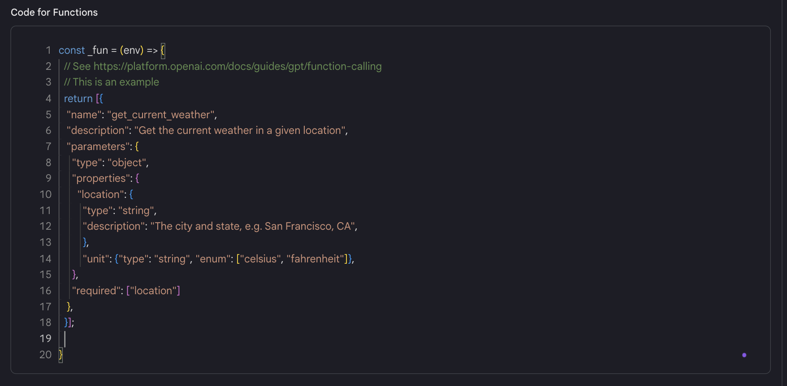
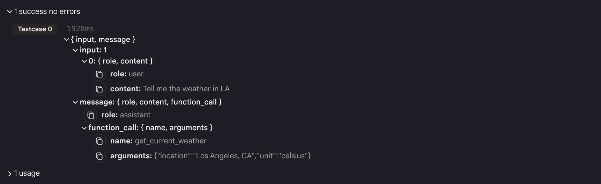
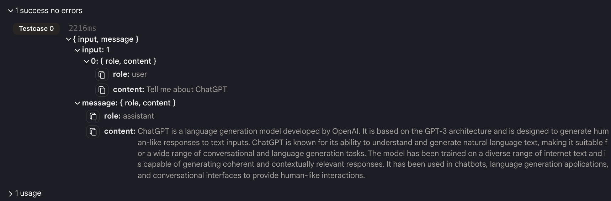

# 関数呼び出し

## 例 1

これは、「ファンクション」機能の使用方法の単純なデモンストレーションです。

- まず、「ファンクション」セクションのコードをコメント解除します。

<figure></figure>

- これは、天気 API の詳細な説明です。この API を使用して都市の天気情報を取得できます。

- 与えられた入力に対して、モデルは関数を呼び出す必要があるかどうかを確認します。

- 必要であれば、関数を呼び出すために必要な引数を含む JSON を提供します。

<figure></figure>

- それ以外の場合、通常のチャットボットのように応答します。

<figure></figure>

- **注意**: 「ファンクション」機能を使用する場合は、実際の関数 API を呼び出す別のアクションを使用する必要があります。言語モデルは関数 API を呼び出すために必要な引数のみを提供します。

## 例 2

これは、「ファンクション」 機能の使用方法およびその結果を 「Http リクエストメーカー」に接続して実際の関数 API を呼び出す複雑な方法の例です。
