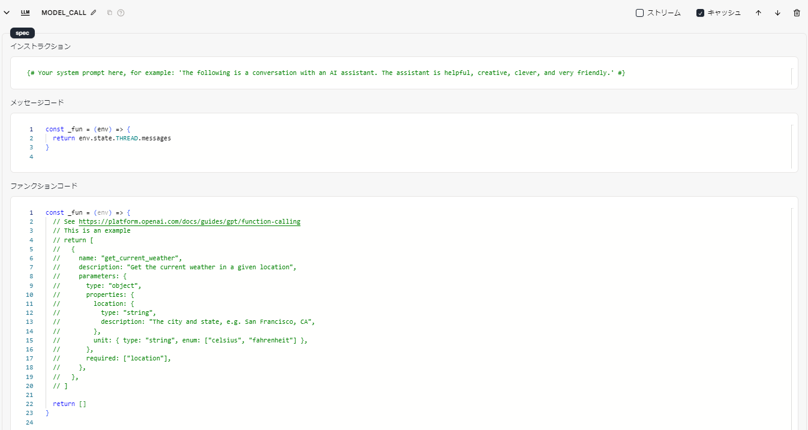
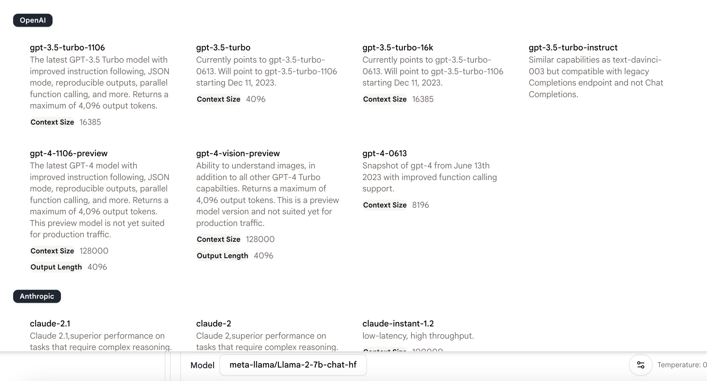
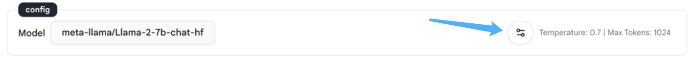
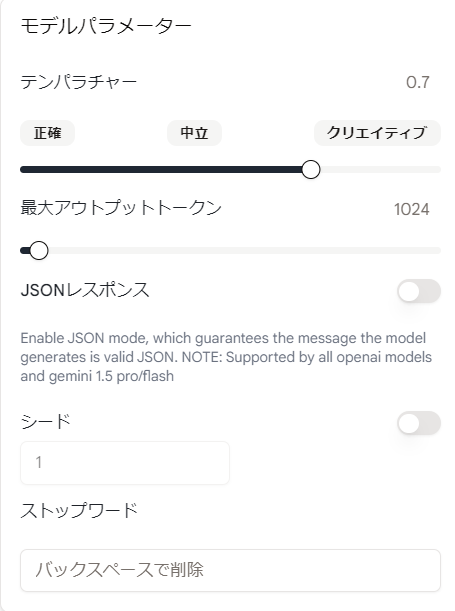

# 言語モデルチャット

## 使用方法

`Language Model Chat Interface` アクションを使用すると、大規模言語モデルと簡単にチャットして複雑な用途を作成できます。

このアクションを使用するには、仕様を書いてモデルを設定し、大規模言語モデルが応答を生成します。

### 仕様

<figure><figcaption></figcaption></figure>

**Instruction**

- これはモデルに送信されるメッセージです。
- ここにプロンプトを書き込み、大規模言語モデルに何をするかを指示します。
- [Tera](https://keats.github.io/tera/docs/) 形式をサポートしています。たとえば、`{{INPUT.messages[0].content}}` を使用してツールの最初のメッセージのコンテンツを取得できます。

**Messages**

- これは大規模言語モデルに送信されるメッセージです。
- ここで他のアクションの出力を Javascript または Tera 形式で参照できます。
- メッセージは文字列のリストまたはオブジェクトのリストにすることができます。オブジェクトのリストの場合、各オブジェクトに `role` フィールドと `content` フィールドがあることを確認してください。:
  - `role` フィールドはメッセージの役割を指定します。許可される役割は `user`、`assistant`、`system` です。
  - `content` はモデルに送信されるメッセージを含みます。
- **Javascript** 形式を使用します。たとえば、`env.state.INPUT.messages` を使用してツールの入力を取得できます。
- **注意:** 配列を返すことを確認してください。
- **注意:** モデルチャットにコンテキストを持たせたい場合は、`Thread message loader` アクションを使用して過去のメッセージを記録および読み込む必要があります。このアクションについて詳しくは[こちら](../tools/thread-message-loader.md)を参照してください。

**Functions**

- 関数呼び出しは、関数を API 呼び出しで記述することで大規模言語モデルを外部ツールに接続し、モデルが 1 つまたは複数の関数を呼び出すための引数を含む JSON オブジェクトを知能的に生成できるようにします。
- この機能により、モデルから構造化データを取得して、外部 API と対話するアシスタントを作成したり、自然言語を API 呼び出しに変換したりするタスクが可能になります。
- **Javascript** 形式を使用します。
<!-- - 「ファンクション」 の使用方法の詳細は[こちら](function-calling.md)です。 -->

### 設定

モデルを選択するには、モデルの名前をクリックします。デフォルトのモデルは「gpt-3.5-turbo-1106」です。

<figure><figcaption></figcaption></figure>

アクションの右下にあるこのボタンをクリックして、構成パネルを開きます。

<figure><figcaption></figcaption></figure>

構成パネルには、次の 5 つの設定があります。

<figure><figcaption></figcaption></figure>

**テンパラチャー**

- 「テンパラチャー」は、モデルの出力のランダム性を制御します。
- モデルのテンパラチャーテンパラチャーが高いほど、出力がよりランダムになります。

**最大アウトプットトークン**

- 「最大アウトプットトークン」は、生成するトークンの最大数を指定します。
- プロンプトとモデルが返すコンテンツを含めて、最大 40,000 トークンまで使用できます（モデルによって制限が異なります）。

**JSON レスポンス**

- 「JSON レスポンス」ボタンを有効にすると、メッセージが JSON 形式で生成されることが保証される JSON モードが有効になります。
- **注意:** この機能はベータ版の機能であり、現時点では OpenAI の「gpt-4-1106-preview」モデルのみがサポートしています。
<!-- - **注意:** この機能 -->
