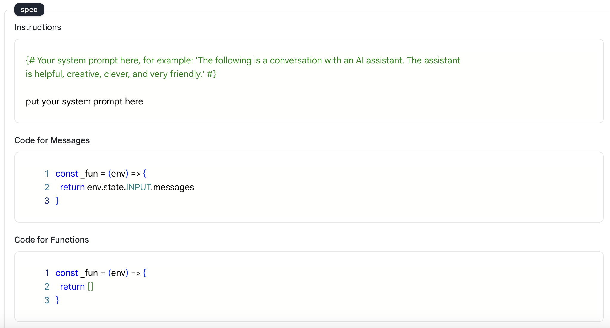
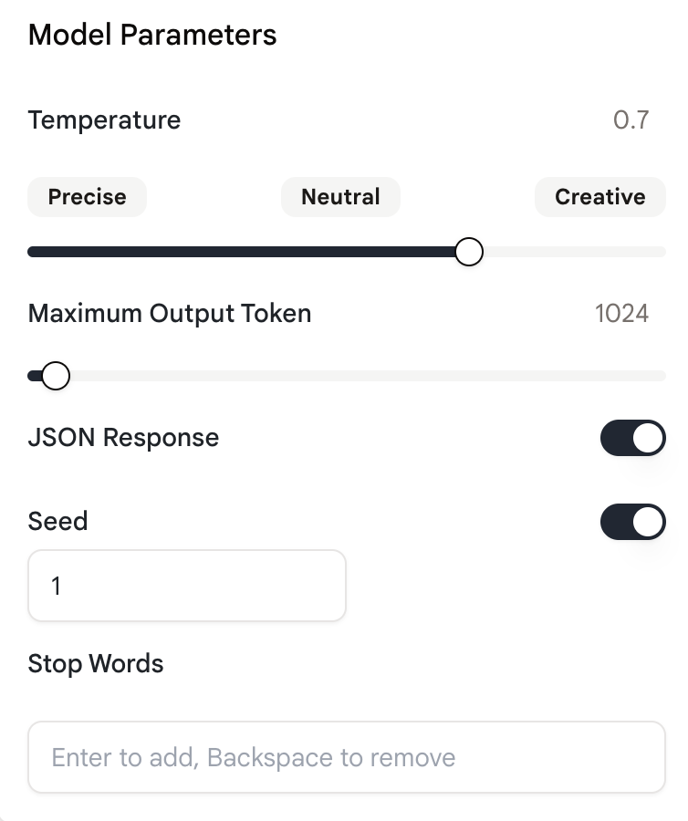
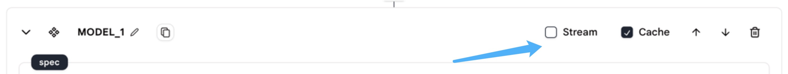

# Language Model Chat

## Usage

We provide the `Language Model Chat` action to easily chat with the large language model and create complex uses.

To use this action you just need to write your specifications and configure the model, and the large language model will generate the response.

### Specification

<figure><figcaption></figcaption></figure>

**Instruction**

* This is the message that will be sent to the model.
* Write your prompt here and tell the large language model what to do.
* Supports [Tera](https://keats.github.io/tera/docs/) format. For example, you can use `{{INPUT.messages[0].content}}` to get the content of the agent's input first message.

**Messages**

* This is the messages that will be sent to the LLM.
* You can refer to the output of other actions here using Javascript or Tera format.
* Messages can be a list of strings or list of objects. If it's a list of objects, make sure each object has a `role` field as well as a `content` field.:
  * The `role` field specifies the role of the message, allowed roles are `user`, `assistant` and `system`.
  * The `content` contains the message to be sent to the model.
* Uses **Javascript** format, for example, you can use `env.state.INPUT.messages` to get the agent's input.
* **NOTE:** Make sure to return an array.
* **NOTE:** If you want the model chat to have context, you should use a `Thread message loader` action to record and load the history messages. For more about this action, see [here](../tools/thread-message-loader.md).

**Functions**

* Function calling allows you to connect large language models to external tools by describing functions in an API call, enabling the model to intelligently generate JSON objects containing arguments for calling one or multiple functions.
* This capability provides a way to obtain structured data from the model, enabling tasks such as creating assistants that interact with external APIs and converting natural language into API calls.
* Uses **Javascript** format.
* [Here](function-calling.md) is a detailed example on how to use "Functions".

### Configuration

You can choose the model you want to use by clicking the model's name, the default model is "gpt-3.5-turbo-1106".

<figure><figcaption></figcaption></figure>

&#x20;

Click this button in the bottom right corner of the `Language Model Chat` action to open the configuration panel.

<figure><figcaption></figcaption></figure>

&#x20;

There are five settings in the configuration panel, as shown below.

<div align="center">

<figure><figcaption></figcaption></figure>

</div>

**Temperature**

* "Temperature" controls the randomness of the model's output.
* The higher the model temperature, the more random the output is.

**Maximum Output Tokens**

* "Maximum Output tokens" specifies the maximum number of tokens to generate.
* Can use up to 40,000 tokens(the limit for models vary), including prompt and model returned content.

**JSON Response**

* "JSON Response" button enable JSON mode, which guarantees the messages the model generate are in JSON format.
* NOTE: This feature is a beta feature and only supported by OpenAI's "gpt-4-1106-preview" model now.
* NOTE: When you use this feature, make sure the word "JSON" is in the context. Otherwise, the OpenAI's API will throw an error.

**Seed**

* The "Seeds" is a parameter that can be specified when using the `Language Model Chat` and `Language Model Completion` actions.
* It helps to ensure consistent outputs by making the system sample deterministically, resulting in the same result for repeated requests with the same seed and parameters.
* NOTE: This feature is a beta feature and may not be supported by all models.

**Stop Words**

* Stop words are used to make the model stop at a desired point, such as the end of a sentence or a list.

&#x20;

On the top right of the action, there are two more things to configure: "Stream Mode" and "Cache Mode".

<figure><figcaption></figcaption></figure>

**Stream**

* This option allows you to receive partial chat responses as they are being generated, rather than waiting for the entire completion to be finished before receiving a response.
* By setting stream mode, you can start processing or displaying the beginning of the chat before the full response is received.

**Cache**

* Caching involves storing frequently accessed data to improve response times without making repeated calls to a model.
* If you use the cache mode, the model will cache the response and return the cached response when the same request is made again. This will make your agent run faster.

### Message Format

Rebyte uses a similar message format as OpenAI. The message format is a JSON object with the following fields:

* Role: could be one from 'user', 'system', or 'assistant'.
* Content: content of this message.
* Name(optional): name of role.
* Context(optional): context of this message.

&#x20;

**Message Format Examples**

1.Simple message

```json
{
    "content": "Hello, how are you?",
    "role": "user"
    "name": "meowoof"
    "context": {
        "files": [
    {
                "uuid": "f3610fef-f490-4675-81fe-df04735f5058",
                "name": "file1.pdf"
            },
            {
                "name": "f3610fef-f490-4675-81fe-df04735f5059",
                "content": "file2.txt"
            }   
    }
}
```

2.List of messages

```json
[
    {
        "content": "You're talking to a chatbot!",
        "role": "system"
    },
    {
        "content": "Hello, how are you?",
        "role": "user"
        "name": "meowoof"
    },
    {
        "content": "I am fine, thank you.",
        "role": "assistant"
        "name": "rebyte"
    },
    {
        "content": "what's your plan today?",
        "role": "user"
        "name": "meowoof"
    }
]
```

## Example Tool

* [Language Model Chat](https://rebyte.ai/p/21b2295005587a5375d8/callable/719d2f31bf9fe977f699/editor)
