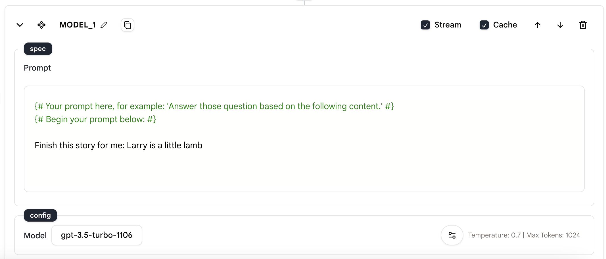
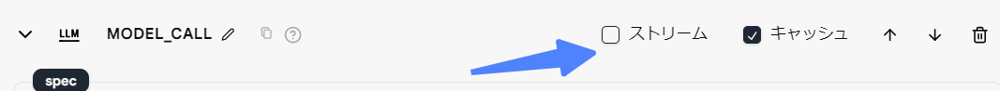

# 言語モデル完了

我々は、`Language Model Completion`アクションを提供しています。このアクションを使用すると、言語モデルがプロンプトを完了し、完成したコンテンツで応答します。

## 使い方

- ツールに`Language Model Completion`アクションを追加します。
- 仕様とパラメータを設定してアクションを構成します。

### 仕様

<figure><figcaption></figcaption></figure>

**プロンプト**

- これはモデルに送信されるプロンプトです。
- モデルはプロンプトを完了し、完成したコンテンツで応答します。

### 設定

構成は[言語モデルチャット](language-model-chat.md)と同じです。

使用するモデルを選択するには、モデルの名前をクリックします。デフォルトのモデルは「gpt-3.5-turbo-1106」です。

<figure><figcaption></figcaption></figure>

&#x20;

`Language Model Completion`アクションの右下にあるボタンをクリックして、構成パネルを開きます。

<figure><figcaption></figcaption></figure>

&#x20;

以下に、構成パネルにある 5 つの設定を示します。

<figure><figcaption></figcaption></figure>

**テンパラチャー**

- 「テンパラチャー」はモデルの出力のランダム性を制御します。
- モデルのテンパラチャーが高いほど、出力はよりランダムになります。

**最大出力トークン**

- 「最大アウトプットトークン」は生成するトークンの最大数を指定します。
- プロンプトとモデルが返すコンテンツを含めて、最大 40,000 トークンまで使用できます。

**JSON レスポンス**

- 「JSON レスポンス」ボタンを有効にすると、モデルが生成するメッセージが JSON 形式であることが保証されます。
- 注意：この機能はベータ機能であり、現在は OpenAI の 「gpt-4-1106-preview」モデルのみがサポートしています。
- 注意：この機能を使用する場合は、コンテキストに「JSON」という単語が含まれていることを確認してください。それ以外の場合、OpenAI の API はエラー返します。

**シード**

- 「シード」は、`Language Model Chat Interface`アクションを使用する際に指定できるパラメータです。
- 同じシードとパラメータを使用して繰り返し要求した場合に同じ結果が得られるようにし、システムのサンプルを確定的に行うためのものです。
- 注意：この機能はベータ機能であり、すべてのモデルでサポートされているわけではありません。

**ストップワード**

- 「ストップワード」は、モデルが必要な時点で停止するようにするために使用されます。これには、文やリストの最後などが含まれます。

アクションの右上には、構成できるものが 2 つあります。「ストリームモード」と「キャッシュモード」です。

<figure><figcaption></figcaption></figure>

**ストリーム**

- このオプションを設定すると、完了が完了するのを待つことなく、部分的なチャット応答を受け取ることができます。
- ストリームモードを設定することで、完全な応答が受け取られる前に、チャットの開始を処理または表示できます。

**キャッシュ**

- 「キャッシュ」は、繰り返しモデルへの呼び出しを行わずに応答時間を改善するために、頻繁にアクセスされるデータを保存することを含みます。
- キャッシュモードを使用すると、モデルは応答をキャッシュし、同じリクエストが再度行われた場合にキャッシュされた応答を返します。これにより、ツールの実行が高速化されます。

### メッセージ形式

imprai は、OpenAI と類似したメッセージ形式を使用します。メッセージ形式は、次のフィールドを持つ JSON オブジェクトです。

- Role: 「user」、「system」、または「assistant」のいずれか。
- Content: このメッセージの内容。
- Name（オプション）: ロールの名前。
- Context（オプション）: このメッセージのコンテキスト。

&#x20;

**メッセージ形式の例**

1. プロンプトの例

```xml
あなたの役割はテキストエディタです。
あなたは、提供されたテキストを熟読し、それを完全に理解し、私のために要約してください。 要約は、元のテキストの主題と重要な詳細を要約する必要があります。 簡潔で自分の言葉で表現されている必要があります。
要約する必要のある内容は、3つの単一引用符で囲まれます。

要約は、次の規則に従って行われる必要があります。
1. 主題の声明：元のテキストの主題または要点を簡潔に要約します。
2. 主要な詳細：元のテキストから、主題またはポイントをサポートする重要な詳細または事実を列挙します。
3. 全体的な結論：元のテキストの結論または著者の立場を要約します。

以下の構造に従って要約を纏めて、私に返信してください：
イントロダクション：元のテキストの主題または背景を紹介します。（改行）
本文パラグラフ：元のテキストからの主要な詳細と議論をリスト化し、自分の言葉で要約します。（改行）
結論：元のテキストの主要なポイントを要約するか、著者の結論を提示します。（改行）

これは要約が必要なコンテンツです：

私に次のフレーズで返信してください：「提供されたURLからコンテンツを取得できませんでした。 Webアドレスの正確性を確認してください」

{{CODE_1.content}}
```

## サンプルツール

- [言語モデル完了](https://rebyte.ai/p/21b2295005587a5375d8/callable/719d2f31bf9fe977f699/editor)
