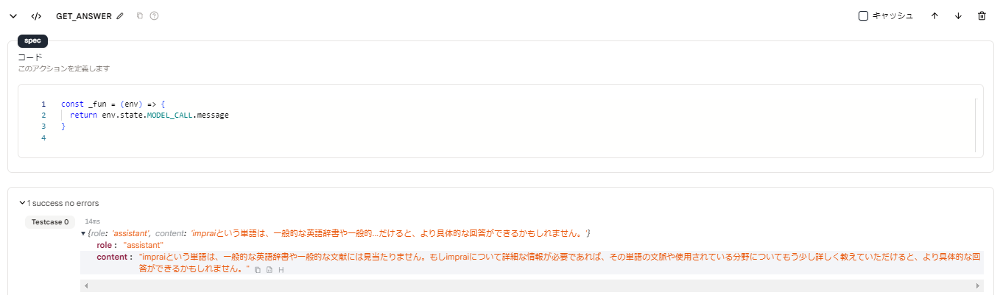
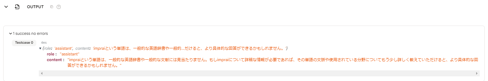

# 出力

- `OUTPUT` アクションは、ツールに出力情報を送信するために使用されます。

- ツールの最後のアクションは `OUTPUT` アクションでなければならず、それを削除したりコピーしたりすることはできません。

- `OUTPUT` アクションの直前のアクションが `OUTPUT` アクションに出力を渡します。`OUTPUT` アクションはその後、ツールのユーザーやツールを呼び出すアプリに出力を提供します。

## 使用方法

- `OUTPUT` アクションの前に `コード` アクションを挿入し、ユーザーに返す結果を指定できます。

- 特別な設定がない場合、`OUTPUT` アクションは最後のアクションの出力をユーザーに返します。

<figure></figure>

<figure></figure>

## データ形式

- ツールページで使用される場合、出力は `OUTPUT` アクションの下に表示されます。

- アプリに接続されている場合、出力はアプリのユーザーに送信されます。

- 出力データ形式は次の通りです：
  ```json
  {
    "role": "assistant",
    "content": "内容"
  }
  ```
