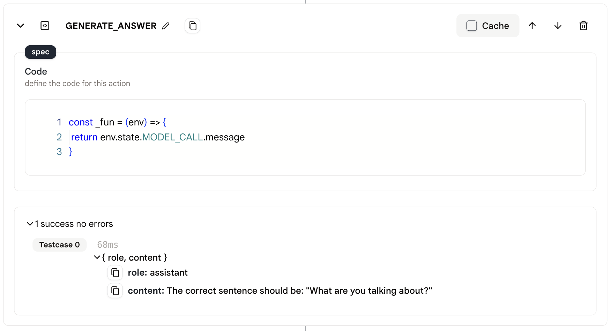
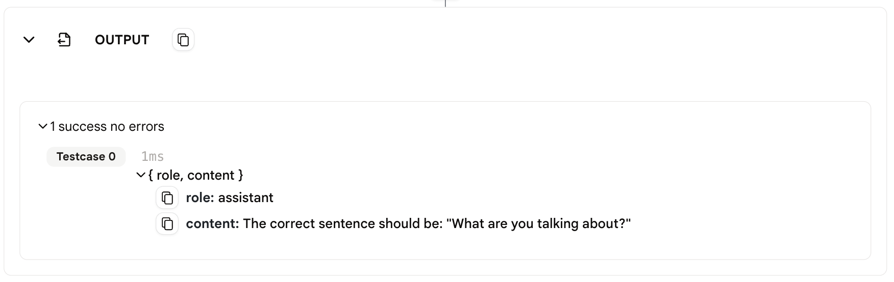

# Output

* The `Output` action is used to send output information to the Tool.

* The last action in the Tool must be an `Output` action, you can not delete it or copy it.

* The last action before the output action will give the output to the `Output` action. The `Output` action then give the output to agent's users or apps calling the agent.

## Usage

* You can insert a `Code` action before the `Output` action and specify the results you want to return to the user.

* With no special settings, the `Output` action will return the last action's output to the user.

<figure></figure>

<figure></figure>

## Data Format

* When used in agent page, the output is shown under the `Output` action.

* When connected to Apps, the output is sent to the App's user.

* The output data format is as follows:
    
    ```json
    {
        "role": "assistant",
        "content": "The content."
    }
    ```