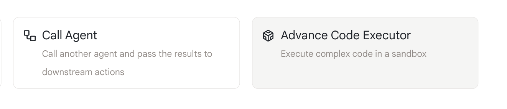
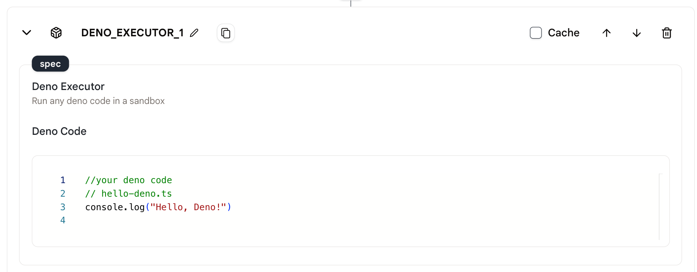
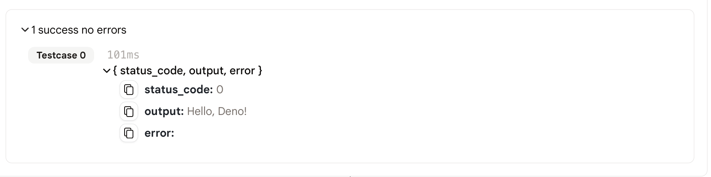

# Advanced Code Executor

このアクションを使用すると、エージェント内で Deno コードを実行できます。

## 使用方法

- まず、エージェント内に「code interpreter」アクションを作成します。

<figure></figure>

- 次に、アクションのエディターにコードを書くことができます。
- 注意: このアクションでは、Typescript と Javascript のコードのみをサポートしています。

<figure></figure>

- 最後に、エージェントを実行して結果を確認します。

<figure></figure>

## 出力

- コードの出力は json オブジェクトで、output がコードの実行結果、status_code が 0 の場合はコードが正常に実行され、error フィールドが空です。
- コードの実行に失敗した場合、status_code は対応するエラーコードになり、error フィールドにはエラーメッセージが含まれます。

```json
{
  "status_code": 0,
  "output": "Hello, Deno!",
  "error:"
}
```

## サンプルエージェント

[こちら](https://rebyte.ai/p/21b2295005587a5375d8/callable/2f9c66ce2d576e5dc181/editor)は、「Deno コードエグゼキューター」アクションを使用するエージェントの簡単な例です。
