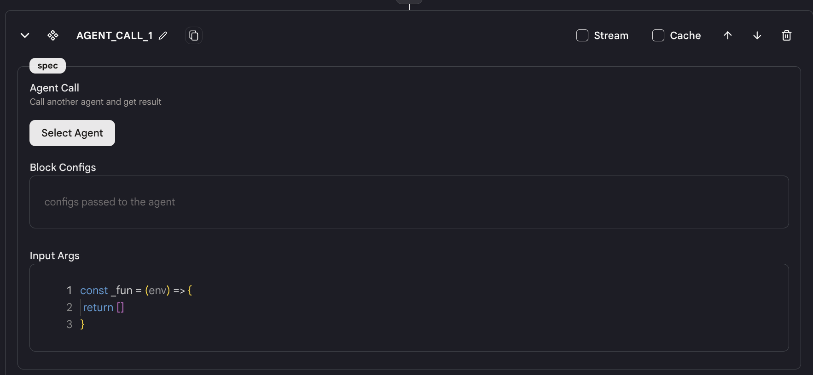
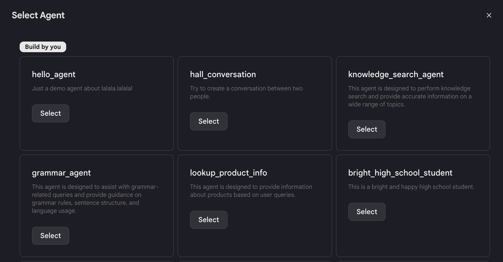
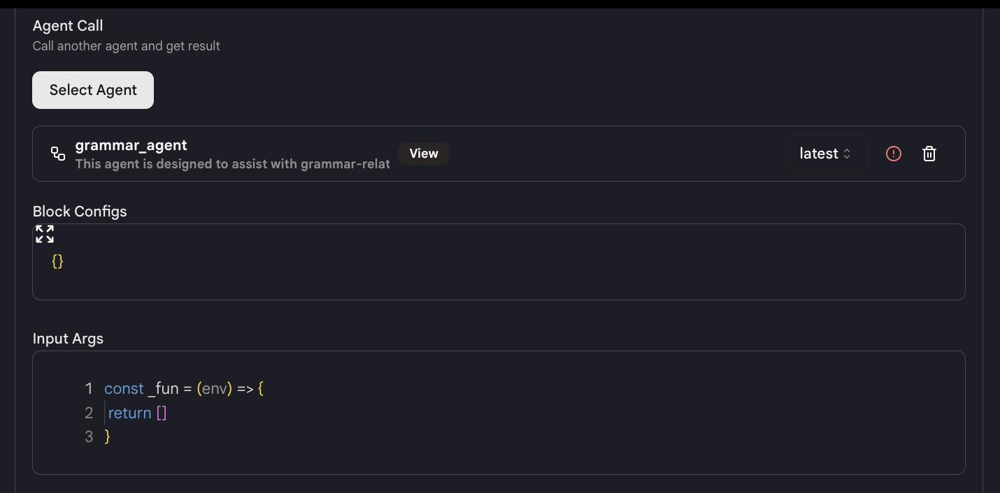
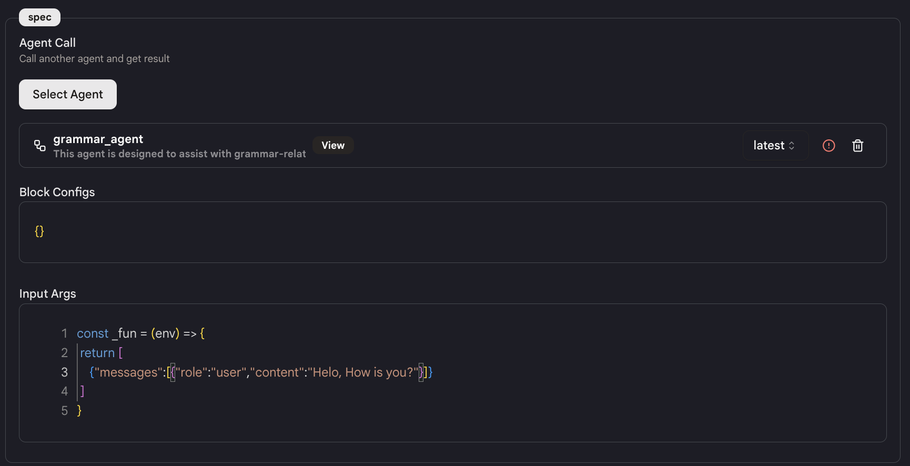
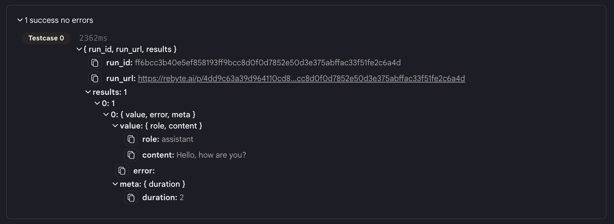

# Call Another Tool

`Call Another Tool` アクションを提供しており、ツール内で他のツールをアクションとして呼び出すことができます。

## 使用方法

- ツールに `Call Another Tool` アクションを追加します。

<figure></figure>

- 呼び出したいツール（ここでは **"ツール B"** とします）を選択し、適切なバージョンを選択します。

<figure></figure>

<figure></figure>

- ツール B の「Input Args」を入力します。ツール B の出力はこのアクションの出力となります。

<figure></figure>

- **注意**: 「Input Args」 を入力する前に、ツール B の入力形式を十分に理解してください。そうでないと、システムがエラーをスローします。

- 「Block Configs」を使用して、ツール B のアクションを構成します。

## 出力

このアクションの出力は以下のようになります:

<figure></figure>

JSON

| パラメーター | タイプ | 説明                             |
| ------------ | ------ | -------------------------------- |
| status.run   | object | 呼び出しの結果（成功または失敗） |
| results      | object | レスポンス                       |
| others       | object | 呼び出されたツールの状態         |
