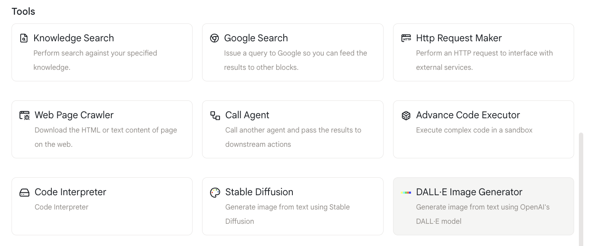
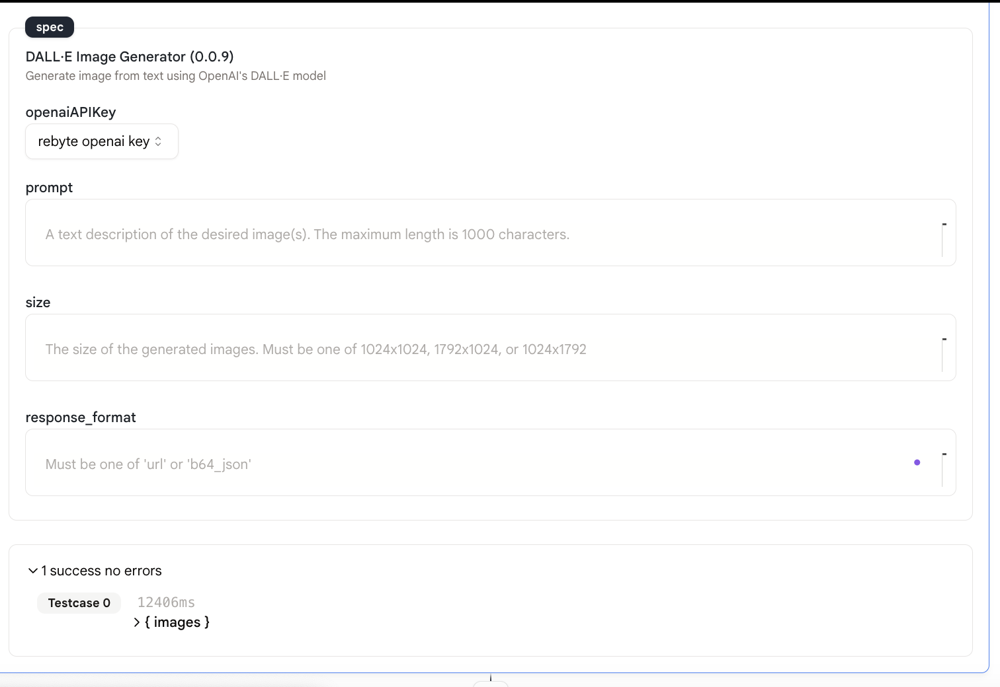
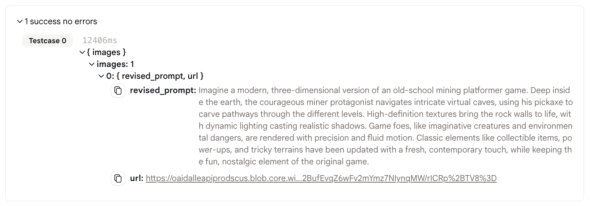

# Dalle 画像生成

このアクションを使用すると、[DALL-E](https://openai.com/blog/dall-e/)モデルを使用してテキストプロンプトを入力し、画像を生成できます。

## 使用法

- まず、エージェントに「Dalle 画像生成」アクションを追加します。

<figure></figure>

- プロンプト、画像サイズ、response_format を入力します。
  - prompt：生成したい画像の詳細な説明。
  - 画像サイズ：生成したい画像のサイズ。次のいずれかである必要があります。「1024x1024」、「1792x1024」、「1024x1792」。
  - response_format：レスポンスの形式。次のいずれかである必要があります。「url」、「base64」。

<figure></figure>
  
## 出力

- このアクションの出力は、URL または base64 エンコードされた画像です。

<figure></figure>

- リンクをクリックすると、生成された画像が表示されます！

<figure></figure>

- 次のアクションで URL を参照するには、 `env.state.REBYTE_OPENAI_IMAGE_GEN_1.images[0].url`または`{{REBYTE_OPENAI_IMAGE_GEN_1.images[0].url}}`を使用できます。
- base64 エンコードされた画像は、 `env.state.REBYTE_OPENAI_IMAGE_GEN_1.images[0].base64`または`{{REBYTE_OPENAI_IMAGE_GEN_1.images[0].base64}}`を使用して参照できます。
