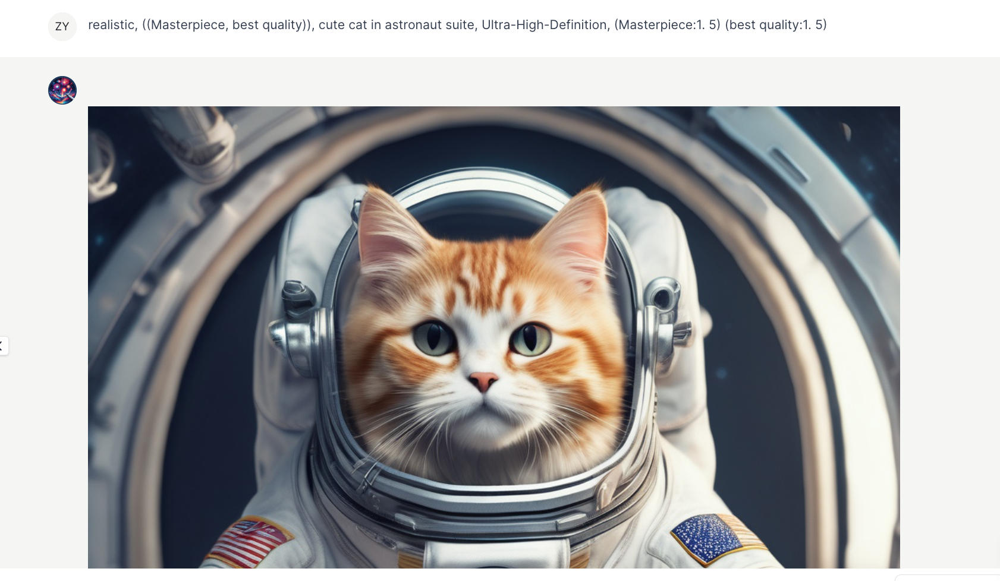
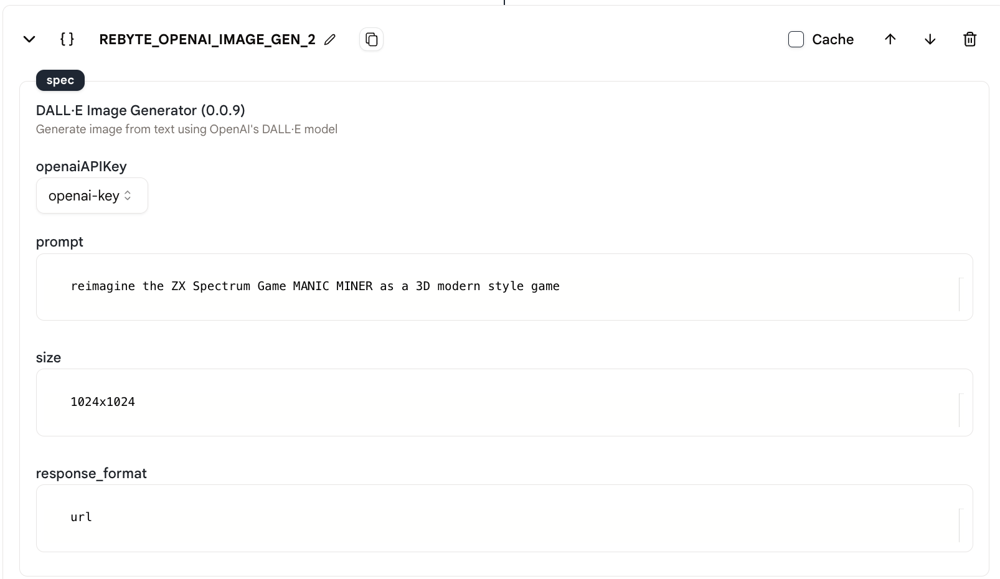
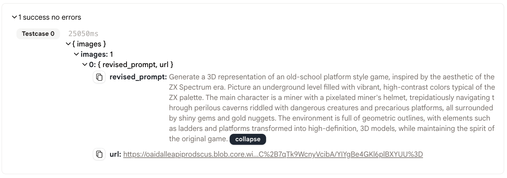

# Stable Diffusion

このアクションでは、テキストプロンプトを入力して Stable Diffusion モデルを使用して画像を生成することができます。

<figure></figure>

## 使用法

1. まず、エージェントに「Stable Diffusion」アクションを追加します。

<figure></figure>

2. プロンプト、画像サイズ、および応答形式を入力します。
   - プロンプト：生成する画像の詳細な説明。
   - 画像サイズ：生成する画像のサイズ。以下のいずれかを指定する必要があります：「1024x1024」、「1792x1024」、「1024x1792」。
   - 応答形式：応答の形式。以下のいずれかを指定する必要があります：「url」、「b64_json」。

<figure></figure>

## 出力

- このアクションの出力は、URLまたはBase64エンコードされた画像です。

<figure></figure>

- リンクをクリックすると、生成された画像が表示されます！

<figure></figure>

- 次のアクションでURLを参照するには、`env.state.REBYTE_OPENAI_IMAGE_GEN_1.images[0].url`または`{{REBYTE_OPENAI_IMAGE_GEN_1.images[0].url}}`を使用できます。
  
- Base64エンコードされた画像は、`env.state.REBYTE_OPENAI_IMAGE_GEN_1.images[0].base64`または`{{REBYTE_OPENAI_IMAGE_GEN_1.images[0].base64}}`を使用して参照できます。

## サンプルエージェント

- [これ](https://rebyte.ai/p/21b2295005587a5375d8/callable/3396e0e83a81396c1ba7/editor)は Stable Diffusion アクションの「HowToUse」エージェントです。

- [これ](https://rebyte.ai/copilot/c359f8a71fa2e7c6264a/session/d67c8195be)は Stable Diffusion のためのアプリです。