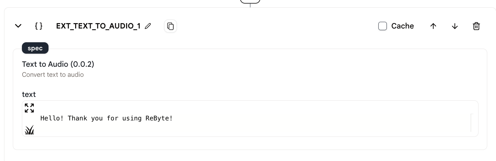
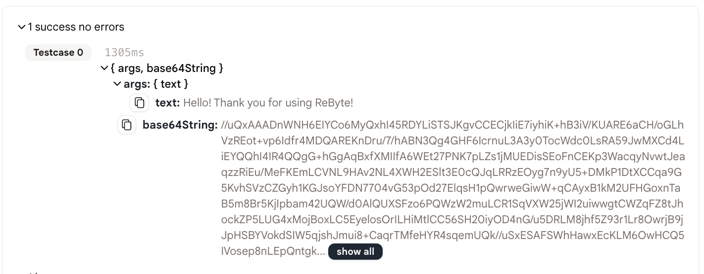

# テキストをオーディオに変換

このアクションを使用すると、テキストを Base64 形式のオーディオに変換できます。

## 使用方法

1. まず、エージェントに「text to audio」アクションを作成します。

<figure></figure>

2. 次に、アクションのエディタに変換したいテキストを書き込みます。

<figure></figure>

3. 最後に、エージェントを実行し、Base64 形式のオーディオ結果を確認します。

<figure></figure>

## 出力

出力は 2 つのフィールド「args」と「base64String」を持つオブジェクトです。「args」フィールドには入力テキストが含まれ、「base64String」フィールドには Base64 オーディオ文字列が含まれます。

```json
{
  "args": {
    "text": "こんにちは！ ReByteを使用していただきありがとうございます！"
  },
  "base64String": "//UklGRiQAAABXQVZFZm10IBAAAAABAAEAgD4AAAB9AAACABAAZGF0YQAAAAAA..."
}
```

## サンプルエージェント

[こちら](https://rebyte.ai/p/21b2295005587a5375d8/callable/30fb713f62a5a2b562a3/editor#1)は、「text to audio」アクションを使用するエージェントのシンプルな例です。
