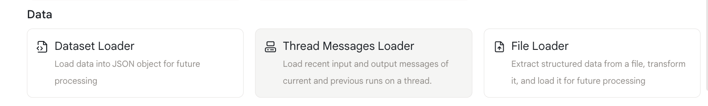
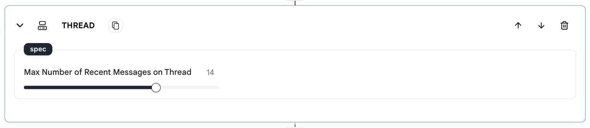
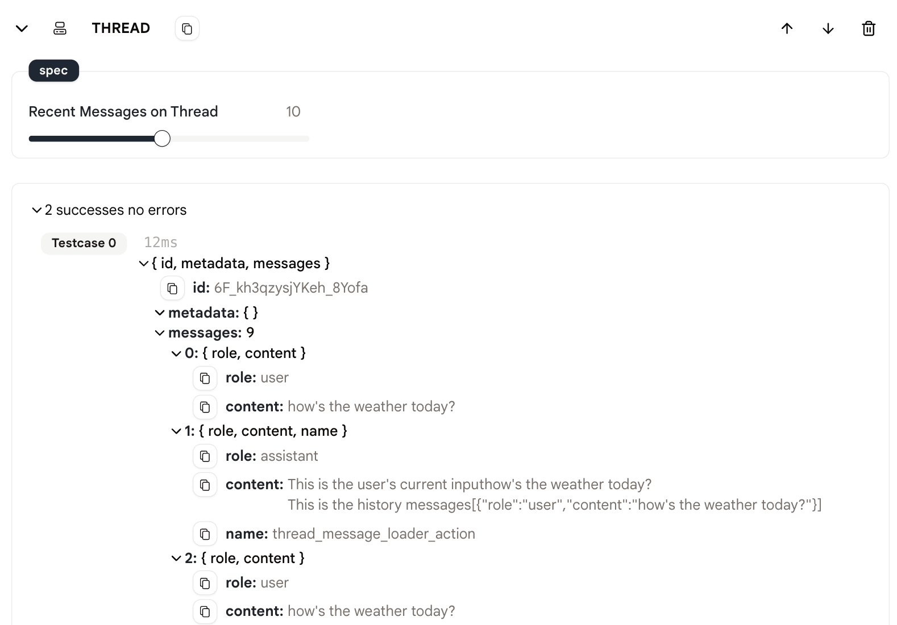

# Thread Message Loader

このアクションを使用すると、エージェント内のスレッドから履歴メッセージをロードできます。

## 使用方法

1. まず、エージェントに `thread-message-loader` アクションを追加します。

<figure>
  
</figure>

2. 「スレッド上の最近のメッセージ」を設定して、ロードしたい最近のメッセージ数を指定します。

<figure>
  
</figure>

3. ロードされたメッセージを会話にコンテキストとして追加するために、次のアクションで使用します。

4. エージェントを実行し、スレッドからロードされたメッセージを確認します。

<figure>
  
</figure>

## サンプルエージェント

[こちら](https://rebyte.ai/p/21b2295005587a5375d8/callable/c6b378f9c462ebbe60a8/editor)は、`thread-message-loader` アクションの使用方法を示すサンプルエージェントです。
