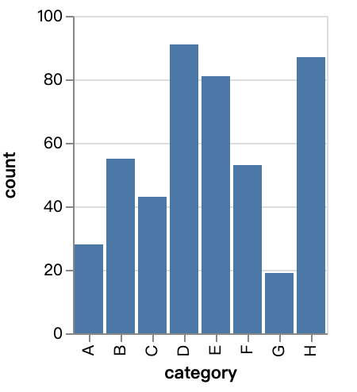

# すべてを可視化

このアクションを使用すると、データを可視化するための Vega-Lite コードを記述できます。このアクションを使用して、棒グラフ、折れ線グラフ、散布図など、さまざまな図を作成できます。

## 使用法

1. まず、エージェントに `visualize-everything` アクションを追加します。

2. `spec` フィールドに Vega-Lite コードを記述します。

3. エージェントを実行すると、図をダウンロードするためのリンクが提供されます。

4. 以下は、コードと svg ファイルの例です。

```
{# Write any code in vega-lite schema and we will give you a link to download the graph #}

{
  "$schema": "https://vega.github.io/schema/vega-lite/v4.json",
  "description": "A simple bar chart with embedded data.",
  "data": {
    "values": [
      {"category": "A", "count": 28},
      {"category": "B", "count": 55},
      {"category": "C", "count": 43},
      {"category": "D", "count": 91},
      {"category": "E", "count": 81},
      {"category": "F", "count": 53},
      {"category": "G", "count": 19},
      {"category": "H", "count": 87}
    ]
  },
  "mark": "bar",
  "encoding": {
    "x": {"field": "category", "type": "ordinal"},
    "y": {"field": "count", "type": "quantitative"}
  }
}
```

<figure>
   
</figure>

## サンプルエージェント

[こちら](https://rebyte.ai/p/21b2295005587a5375d8/callable/2852459e7cc4370f1b50/editor)は、`visualize-everything` アクションの使用方法を示すデモエージェントです。
