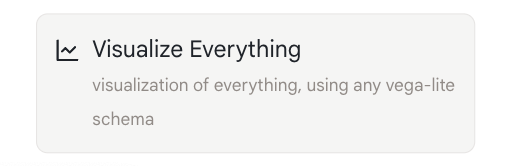
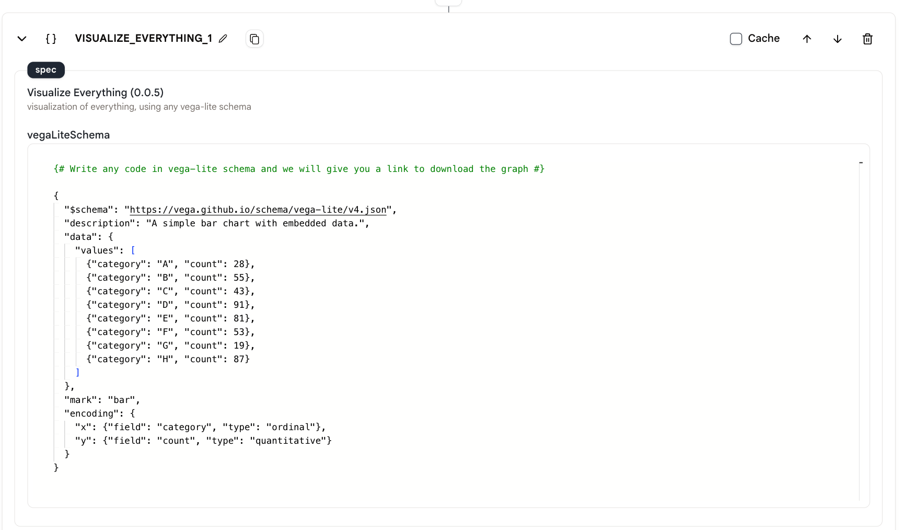
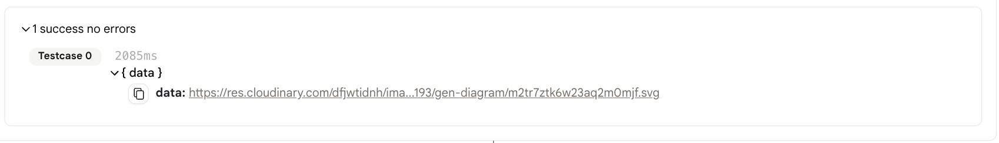

# Visualize Everything

This action allows you to write vega-lite code to visualize your data. You can use this action to create a variety of visualizations, including bar charts, line charts, scatter plots, and more.

## Usage

* First, add a `visualize-everything` action to your agent.

<figure>
   
</figure>

* Write your vega-lite code in the `spec` field. 

<figure>
   
</figure>

* Run the agent and we will provide you with a link to download your visualization.

<figure>
   
</figure>

* Here's an example of the code and the svg file.

```
{# Write any code in vega-lite schema and we will give you a link to download the graph #}

{
  "$schema": "https://vega.github.io/schema/vega-lite/v4.json",
  "description": "A simple bar chart with embedded data.",
  "data": {
    "values": [
      {"category": "A", "count": 28},
      {"category": "B", "count": 55},
      {"category": "C", "count": 43},
      {"category": "D", "count": 91},
      {"category": "E", "count": 81},
      {"category": "F", "count": 53},
      {"category": "G", "count": 19},
      {"category": "H", "count": 87}
    ]
  },
  "mark": "bar",
  "encoding": {
    "x": {"field": "category", "type": "ordinal"},
    "y": {"field": "count", "type": "quantitative"}
  }
}
```

<figure>
   
</figure>

## Example Tool

[Here](https://rebyte.ai/p/21b2295005587a5375d8/callable/2852459e7cc4370f1b50/editor) is a demo agent to show you how to uses the `visualize-everything` action.
