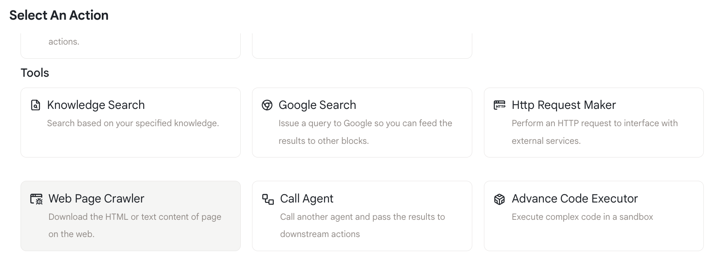
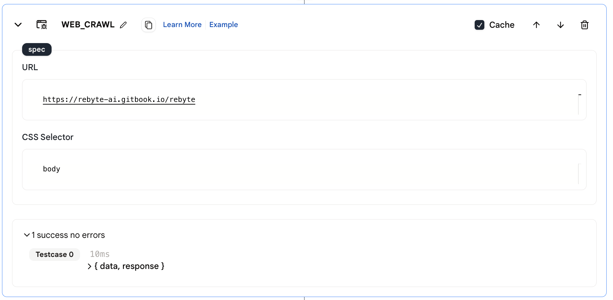
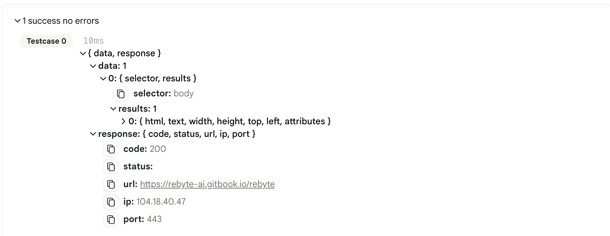

# Web Page Crawler

This action helps you retrieves the HTML content from  a certain web page.

## Usage 

* First, add a web crawl action to your agent using the **+** button in the agent editor.

<figure></figure>

* Specify the URL that you want to crawl and the CSS selector that you want to use to get the content from the page.

**Parameters:**
* URL: The URL that you want to get data from
* CSS selector: we will only get content using your specified CSS selector

<figure></figure>

* Run the agent and you will see the results in the action's output.

## Output

* The output is a json object with the following fields:
    * `data`: the content of the page
    * `response`: the response object from the request
  
<figure></figure>

## Example Tool

* [Web Page Crawler](https://rebyte.ai/p/21b2295005587a5375d8/callable/35358e328e30adf8a737/editor) 
