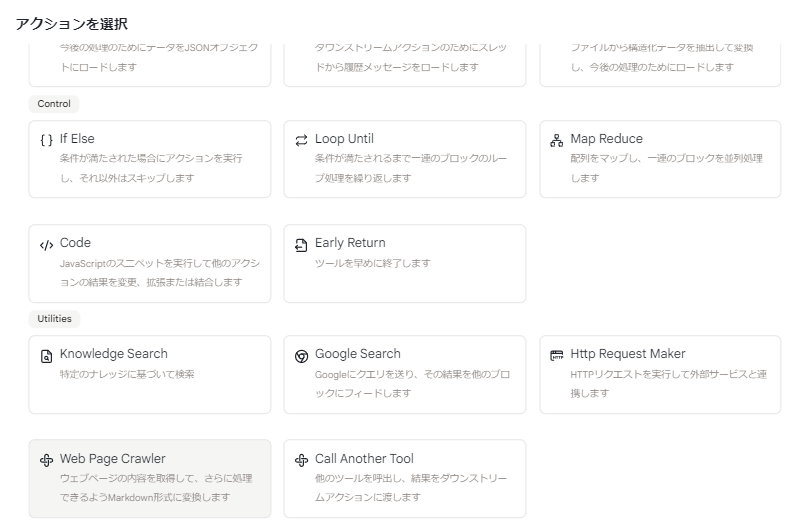
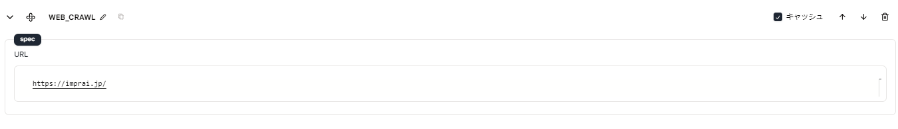
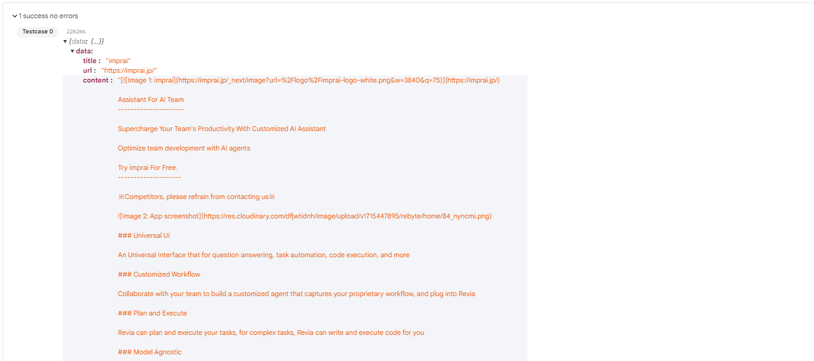

# ウェブページクローラー

このアクションは、特定のウェブページから HTML コンテンツを取得します。

## 使用方法

1. まず、ツールエディタで **+** ボタンを使用してウェブクロールアクションを追加します。

<figure></figure>

2. クローリングしたい URL を指定します。

**パラメータ:**

- URL：データを取得したい URL
<!-- - CSS セレクタ：指定した CSS セレクタを使用してコンテンツを取得します -->

<figure></figure>

3. ツールを実行し、アクションの出力で結果を確認します。

<figure></figure>

## 出力

- 出力は以下のフィールドを持つ JSON オブジェクトです：
  - `data`: ページのコンテンツ
  - `response`: リクエストからのレスポンスオブジェクト

<!-- ## サンプルツール

- [ウェブページクローラー](https://rebyte.ai/p/21b2295005587a5375d8/callable/35358e328e30adf8a737/editor) -->
