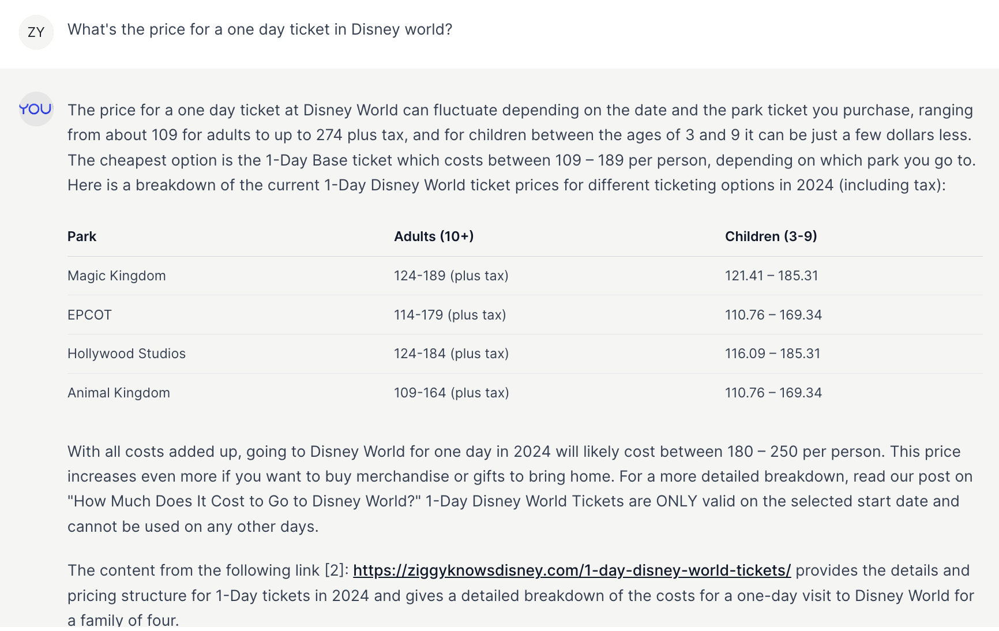
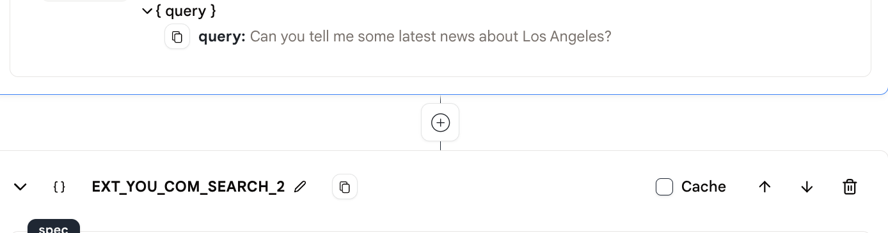
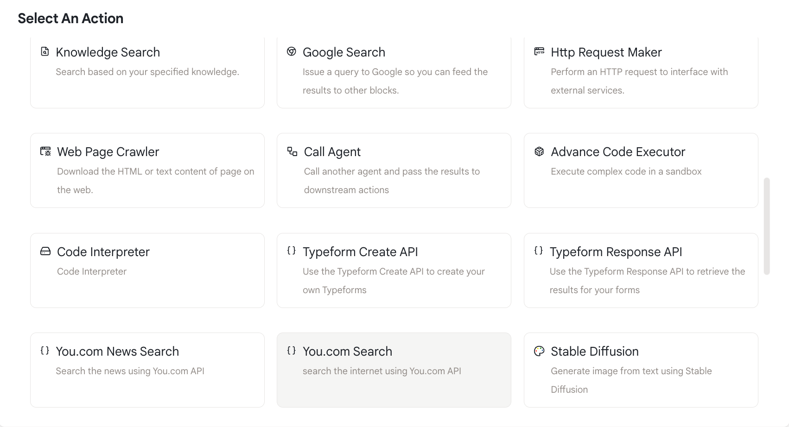
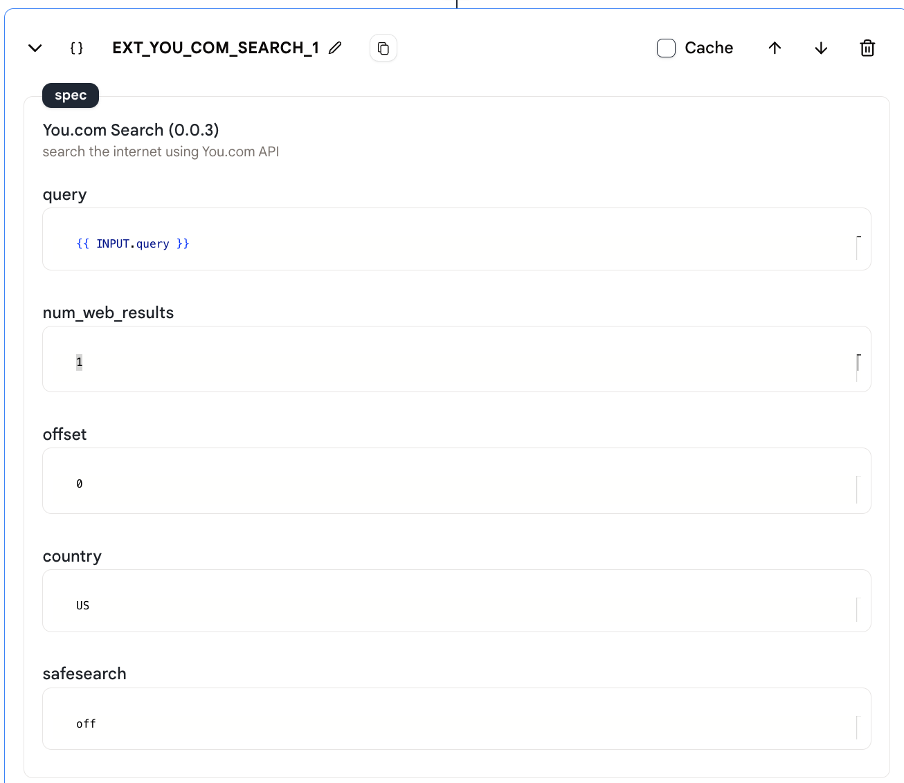
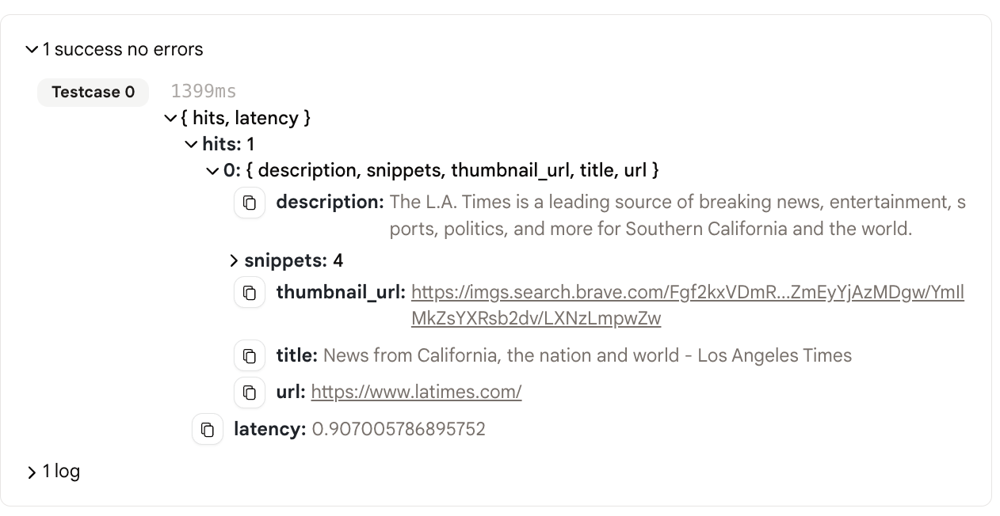

# You.com 検索

この「You.com」検索アクションを使用すると、何でも検索して数秒で結果を取得できます！

<figure></figure>

## 使用方法

1. まず、プラスボタンを使用して「You.com」検索アクションを追加します。

<figure></figure>

2. 「You.com 検索」アクションを選択します。

<figure></figure>

3. 設定できるパラメータがいくつかあります。
   - クエリ: 検索クエリ。
   - num_web_results: 取得する Web 結果の数。
   - オフセット: 検索結果のオフセット。オフセットが 0 の場合、最初の結果は検索結果の最初の結果です。オフセットが 10 の場合、最初の結果は検索結果の 11 番目の結果です。
   - 国: 国コード。たとえば、アメリカ合衆国の場合は「US」です。
     - 国リストには、'AR'、'AU'、'AT'、'BE'、'BR'、'CA'、'CL'、'DK'、'FI'、'FR'、'DE'、'HK'、'IN'、'ID'、'IT'、'JP'、'KR'、'MY'、'MX'、'NL'、'NZ'、'NO'、'CN'、'PL'、'PT'、'PH'、'RU'、'SA'、'ZA'、'ES'、'SE'、'CH'、'TW'、'TR'、'GB'、'US' が含まれています。
   - safesearch: セーフサーチモードです。「strict」、「moderate」、または「off」のいずれかです。

<figure></figure>

4. エージェントを実行し、検索結果を確認します。

### 出力

<figure></figure>

- 出力は少し複雑で、2 つのフィールド、「hits」と「latency」があります。

- 検索結果は「hits」フィールドに含まれており、最も関連性の高い検索結果が含まれています。

## サンプルエージェント

- このアクションを見て、使用するには、次のサンプルエージェントをご覧ください：[You.com 検索](https://rebyte.ai/p/21b2295005587a5375d8/callable/b6e67fc59579d6304fef/editor)。
