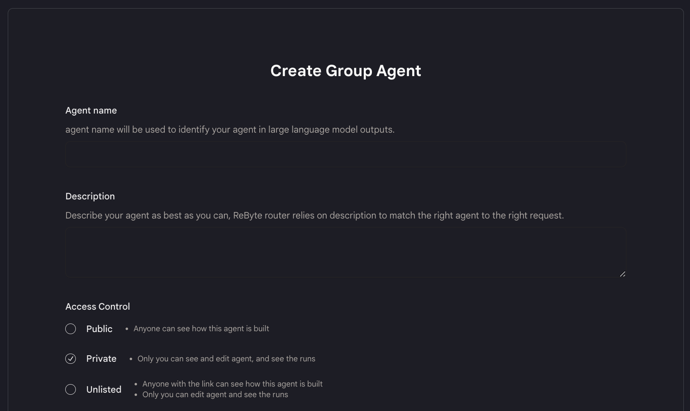
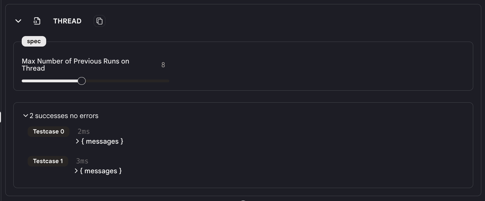
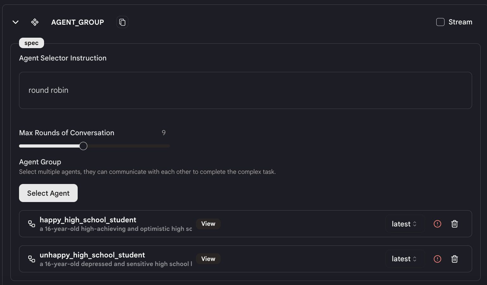

# クイックスタート

このチュートリアルでは、2 つのエージェントについて議論するグループエージェントを作成する方法を示します。

## ステップ 1: グループエージェントを作成

- サイドバーの「エージェント」タブに移動し、右上の「エージェントを作成」をクリックします。

- 「グループエージェント」オプションを選択します。

- 名前、説明を記入し、グループエージェントの可視性を設定します。

<figure></figure>

## ステップ 2: グループエージェントを設計

- このエージェントには 4 つのアクションしかありません：`入力（Input）`、`スレッド（Thread）`、`エージェントグループ（Agent Group）`、`出力（Output）`。これらのアクションを追加または削除することはできません。

- `入力`および`出力`アクションはスタックエージェントと同様です。独自のデータセットを作成してエージェントをテストすることができます。

**スレッド（Thread）**

<figure></figure>

- トグルボタンを使用して、`スレッド`アクションで「過去の実行の最大数」を設定します。これは、エージェントが毎回実行する際に記録しモデルに送信する履歴メッセージの最大数です。

- 履歴が長いほど、モデルが利用できるコンテキストが増えます。ただし、履歴が長いほど、エージェントの実行速度は遅くなります。

**エージェントグループ（Agent Group）**

<figure></figure>

- `エージェントグループ`アクションで使用するエージェントを選択します。ここでは、作成した 2 つの学生チャットボットエージェントを選びます。

- 注意：エージェントの機能とエージェントの入力および出力フォーマットに精通している必要があります。また、エージェントの出力フォーマットが次のエージェントの入力フォーマットと互換性があることを確認してください。

- グループエージェント内のエージェントの実行順序を指定します。エージェントは指定した順序で実行されます。例えば、ここでは「ラウンドロビン」をエージェントセレクターの指示として設定しているため、エージェントは 1 つずつループで実行されます。

- 指定された順序に従い、システムはエージェントを 1 つずつ実行します。最初のエージェントの出力は、次のエージェントの入力となります。

- また、エージェント間の会話の最大ラウンド数を設定できます。エージェント間の会話が最大ラウンド数を超えると、エージェントは実行を停止します。

これで完了です！

## ステップ 3: グループエージェントをテスト

- 基本的には[スタックエージェントをテストする](../../test-your-agent/overview.md)のと同じです。

- 唯一の違いは、1 つのエージェントの出力だけに焦点を当てるのではなく、グループエージェント内のすべてのエージェントの出力をよく見て、それらの動作が期待通りであるかどうかを確認することです。
