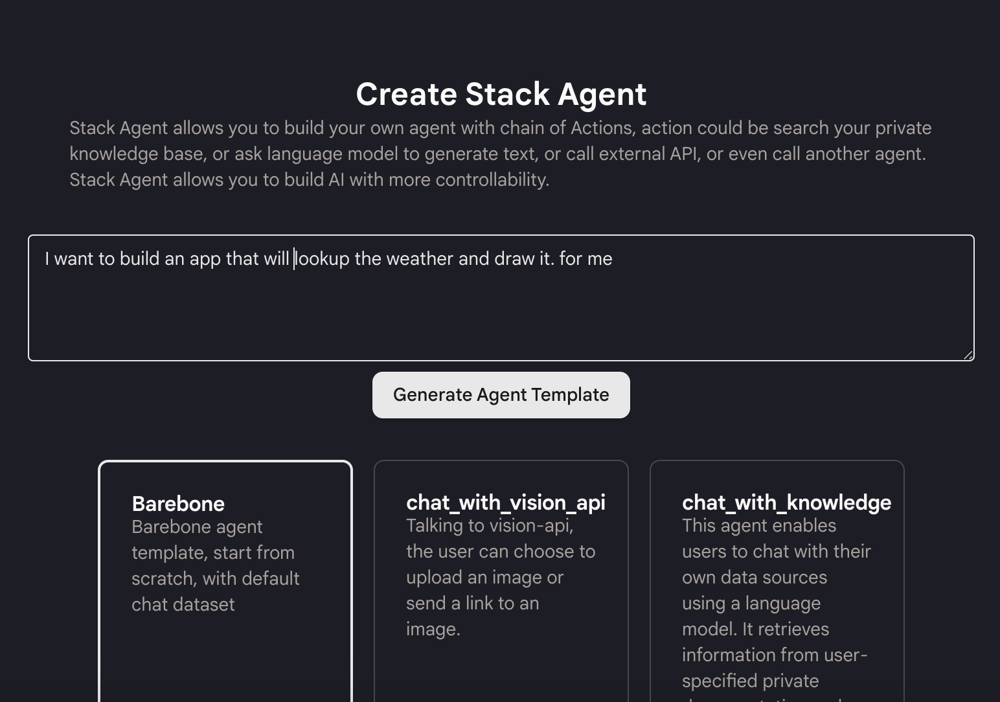
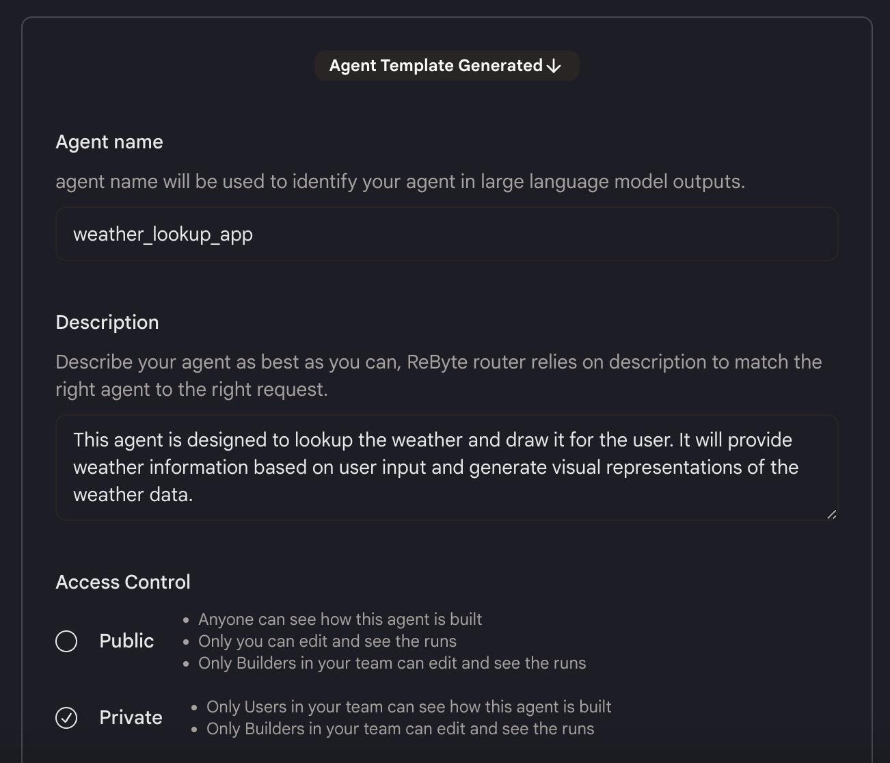
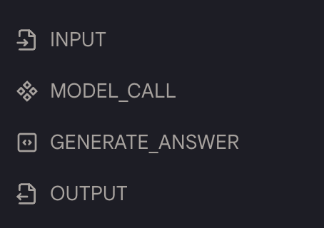
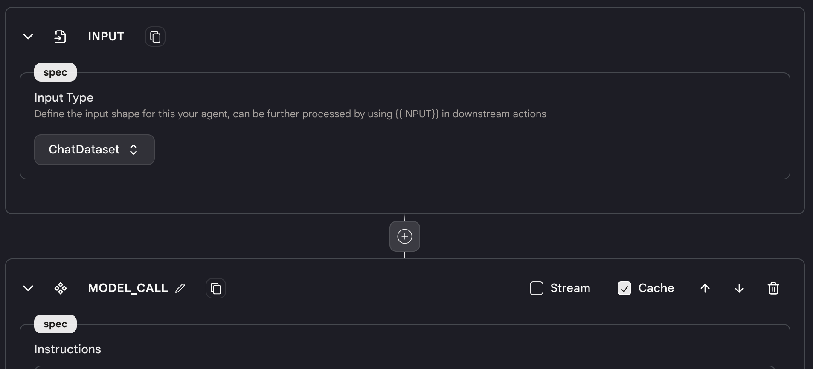
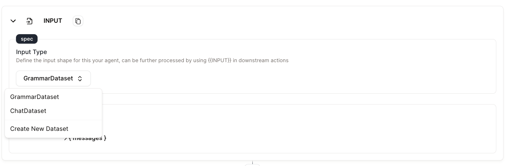
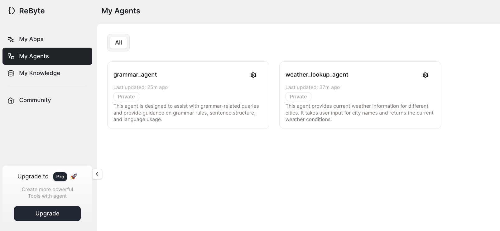

# クイックスタート

10分で天気予報エージェントを作成する方法を説明します。

## ステップ1：エージェントを作成する

* サイドバーの「マイエージェント」タブに移動し、「エージェントを作成」をクリックします。

* このエージェントで何をしたいかを説明し、適切なテンプレートを選択します。

<figure></figure>

* 「エージェントテンプレートを生成」ボタンをクリックすると、基本的なテンプレートが生成されます。

<figure></figure>

* エージェントの名前、説明、可視性を変更し、追加情報を提供するためにタグを追加できます。現在のテンプレートが気に入らない場合は、再生成することもできます。

* 「エージェントを作成」をクリックすると、数秒でエージェントが作成されます。

## ステップ2：エージェントを設計する

* 自動生成されたテンプレートには、いくつかのアクションが既に作成されています。

<figure></figure>

* エージェントを構築するプロセス：
  * ユーザーの入力から場所を取得するため、`Language Model Chat`アクションが必要です。
  * 天気を検索するためには、`You.com`検索エンジンアクションを使用します。
  * 結果を分析するためには、You.com検索からの結果を分析し、画像を描くためのプロンプトを生成するために別の`Language Model Chat`を使用します。
  * 画像を描くためには、`Stable Diffusion`アクションを使用し、Base64形式の画像を返します。

<figure></figure>

* エディターでモデルに指示を書き、モデルに何をさせたいかを説明します。

<figure></figure>

## ステップ3：エージェントをテストする

* 上部の「データセット」タブをクリックし、「データセットを作成」をクリックします。

* データセットの名前と説明を記入します。

* これはチャットボットなので、テストデータセットは会話を表すJSONオブジェクト（リスト）の形式になります。

<figure></figure>

* データセットを作成したら、「デザイン」パネルに戻り、新しいデータセットを入力として選択します。

<figure></figure>

* 「テストケースを実行」をクリックして、データセットを使用してエージェントをテストします。

* 結果は各アクションの下に表示されます。出力が期待通りか確認し、そうでない場合はエージェントの設定を変更して再試行します。

<figure></figure>

## ステップ4：エージェントをデプロイする

* 右上の「エージェントをデプロイ」をクリックし、「新しいバージョンをデプロイ」をクリックします。

* ReByteアプリでエージェントを使用するか、提供されるコードを使用して独自のアプリに統合できます。

<figure></figure>

🎉 **おめでとうございます、最初のエージェントを作成しました！**

「マイエージェント」タブですべてのエージェントを表示できます。ここでエージェントをクローン、保存、削除することもできます。

<figure></figure>