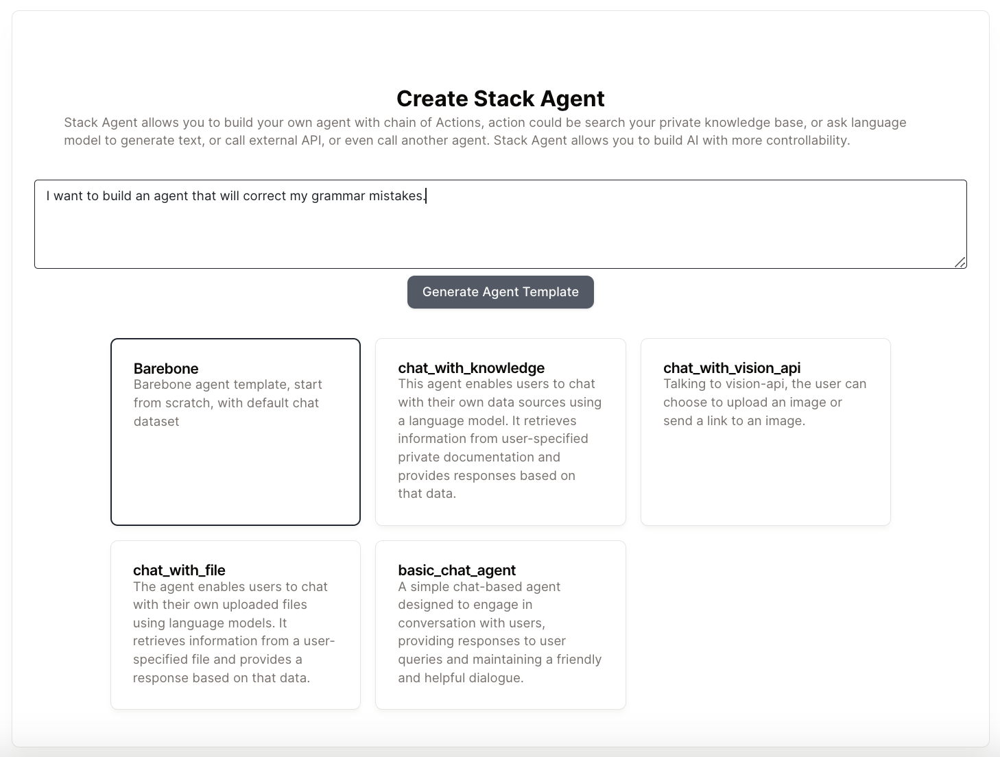

# クイックスタート

5分で文法チェックエージェントを作成する方法を説明します。

## ステップ1：エージェントを作成する

* サイドバーの「マイエージェント」タブに移動し、「エージェントを作成」をクリックします。

* このエージェントで何をしたいかを説明し、適切なテンプレートを選択します。

<figure></figure>

* 「エージェントテンプレートを生成」ボタンをクリックすると、基本的なテンプレートが生成されます。

* エージェントの名前、説明、可視性を変更し、追加情報を提供するためにタグを追加できます。現在のテンプレートが気に入らない場合は、再生成することもできます。

<figure></figure>

* 「エージェントを作成」をクリックすると、数秒でエージェントが作成されます。

## ステップ2：エージェントを設計する

* 自動生成されたテンプレートには、いくつかのアクションが既に作成されています。

* 文法チェッカーのようなシンプルなエージェントを構築するためには、追加のアクションは必要ありません。より複雑なエージェントの場合は、異なるアクション間のプラスボタンをクリックしてアクションを追加できます。

* エディターでモデルに指示を書き、モデルに何をさせたいかを説明します。

<figure></figure>

## ステップ3：エージェントをテストする

* 上部の「データセット」タブをクリックし、「データセットを作成」をクリックします。

* データセットの名前と説明を記入します。

* これはチャットボットなので、テストデータセットは会話を表すJSONオブジェクト（リスト）の形式になります。

<figure></figure>

* データセットを作成したら、「デザイン」パネルに戻り、新しいデータセットを入力として選択します。

<figure></figure>

* 「テストケースを実行」をクリックして、データセットを使用してエージェントをテストします。

* 結果は各アクションの下に表示されます。出力が期待通りか確認し、そうでない場合はエージェントの設定を変更して再試行します。

<figure></figure>

## ステップ4：エージェントをデプロイする

* 右上の「エージェントをデプロイ」をクリックし、「新しいバージョンをデプロイ」をクリックします。

* ReByteアプリでエージェントを使用するか、提供されるコードを使用して独自のアプリに統合できます。

<figure></figure>

🎉 **おめでとうございます、最初のエージェントを作成しました！**

「マイエージェント」タブですべてのエージェントを表示できます。ここでエージェントをクローン、保存、削除することもできます。

<figure></figure>

**このエージェントを[こちら](https://rebyte.ai/p/21b2295005587a5375d8/callable/a6e8029461744868f576/editor)で試すことができます。**