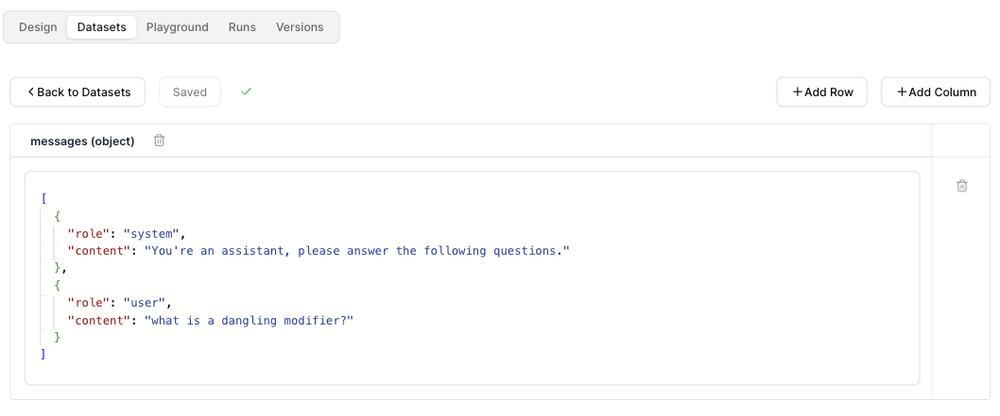

# Datasets

After designing your agent, you can test it with datasets.

You can run the dataset with the "Run Testcases" and observe the agent's response and maybe troubleshoot issues based on it.

## Dataset Creation

* Navigate to the `Datasets` tab on the top.

* Click on `Create Dataset` button.

* Use "Add Column" to add a new field to your dataset. "Add Row" to add a new dataset item.

<figure><figcaption></figcaption></figure>

## Data types supported

We support the following data types:

* String
* Number
* Boolean
* Object
