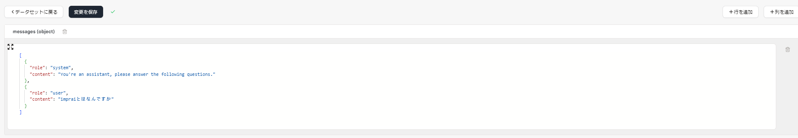

# データセット

ツールを設計した後、データセットを使用してテストすることができます。

「テストケースの実行」ボタンを使用してデータセットを実行し、ツールの応答を観察し、それに基づいて問題をトラブルシューティングすることができます。

## データセットの作成

- 画面上部の`データセット`タブに移動します。

- `データセット作成`をクリックします。

- 「列を追加」を使用してデータセットに新しいフィールドを追加します。「行を追加」を使用して新しいデータセットアイテムを追加します。

<figure><figcaption></figcaption></figure>

## サポートされているデータタイプ

以下のデータタイプをサポートしています：

- 文字列（String）
- 数値（Number）
- ブール値（Boolean）
- JSON オブジェクト（JSON Object）

## 使用方法

データセットは 2 つの方法で使用できます：

#### 1. 後続のアクションのためにデータをロードする

ロードされたデータセットは後続のアクションで使用できます。

データセットにいくつかのプロンプトのアンプルデータが含まれている場合に非常に便利です。

#### 2. ツールの入力形式を決定する

`INPUT`アクションのデータセットは、ツール全体の入力形式を決定します。
