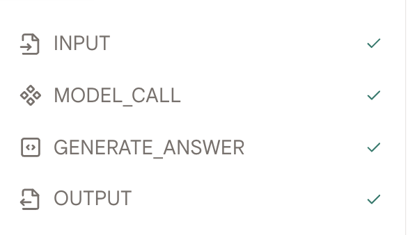
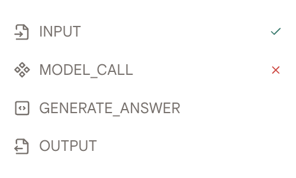
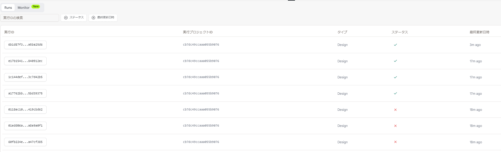

# 概要

ここでは、基本的な概念を紹介し、ツールをテストする方法を説明します。

## テストデータセットの作成

- データセットはツールをテストするために使用されます。データセットリストページで「データセットを作成」ボタンをクリックしてテストデータセットを作成できます。

## テストとデバッグ

- テストデータセットを作成したら、「デザイン」ページに移動し、データセットを選択します。

- 「テストケースの実行」ボタンをクリックして、選択したデータセットでツールを実行します。

- 実行結果は各アクションごとに表示されます。

- 実行プロセスにバグがない場合は、左側に緑色のチェックマークが表示されます。

<figure></figure>

- それ以外の場合は、問題のあったアクションに赤いバツマークが表示されます。

<figure></figure>

- 各アクションが実行後、実行結果は「実行」タブに記録されます。実行 ID、実行時刻、実行ステータス、および実行に使用されたツールが提供されます。

- 各実行の「実行 ID」をクリックして、実行の詳細を確認します。

<figure></figure>
<!-- 
## プレイグラウンド

- テストをより柔軟に行いたい場合は、プレイグラウンドを使用してツールをテストすることができます。

- 公開前にこの機能を十分に活用してツールをテストすることをお勧めします。

<figure></figure> -->
