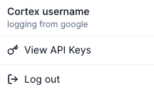

# Authentication

Cortex uses an API key to authenticate HTTP requests. Find your API key in the drop down of your profile where it says View API Keys.

<figure><figcaption></figcaption></figure>

API requests should include your API key in the HTTP header.

```http
Authorization: Bearer CORTEX_API_KEY
```
