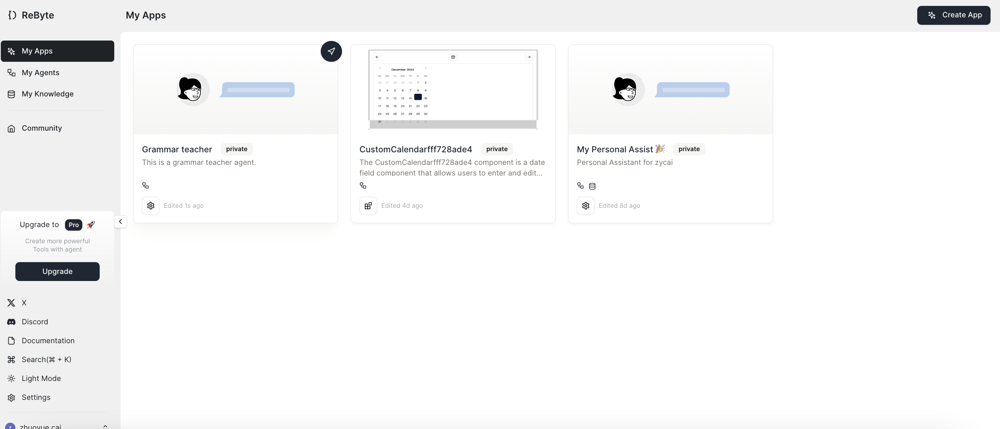
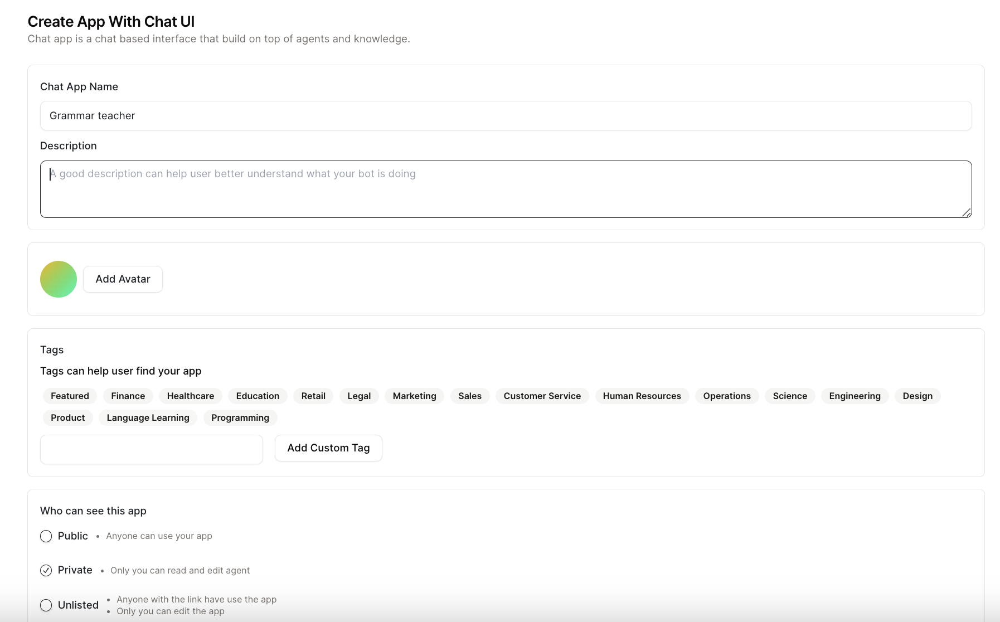
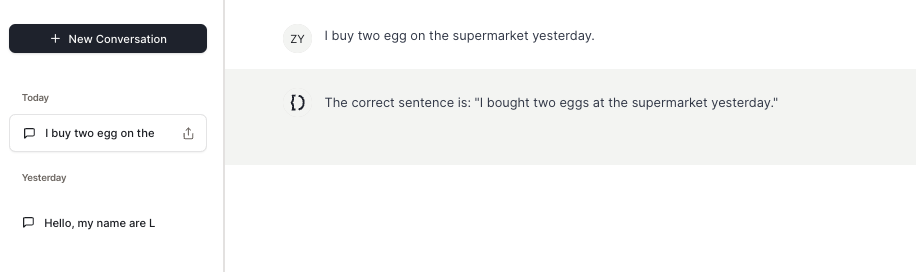

# クイックスタート

チャットインターフェースを持つアプリを構築する方法を説明します。

## ステップ1：アプリを作成する

* サイドバーの「マイアプリ」タブに移動し、右上の「アプリを作成」をクリックします。「チャットインターフェース付きアプリ」を選択します。

<figure></figure>

* アプリに関する情報を入力します。

<figure></figure>

* アプリのベースにしたいエージェントを選択し、エージェントのバージョンを選択します。

<figure></figure>

* 「チャットUIでアプリを作成」をクリックして完了です！

## ステップ2：アプリを使用する

<figure></figure>

🎉 これでチャットインターフェースでアプリを使用できます！

**このアプリを[こちら](https://rebyte.ai/copilot/b1518cc7d7d76055f4b3/session/2d1a606382)で試すことができます**