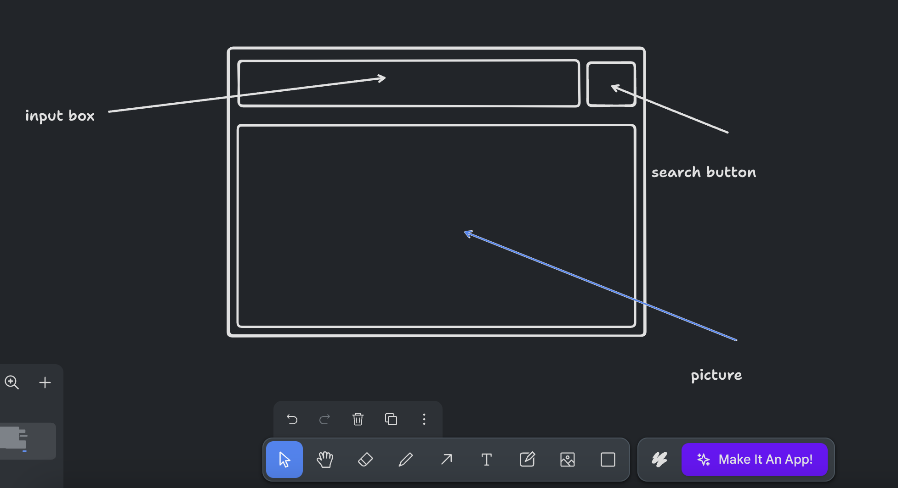
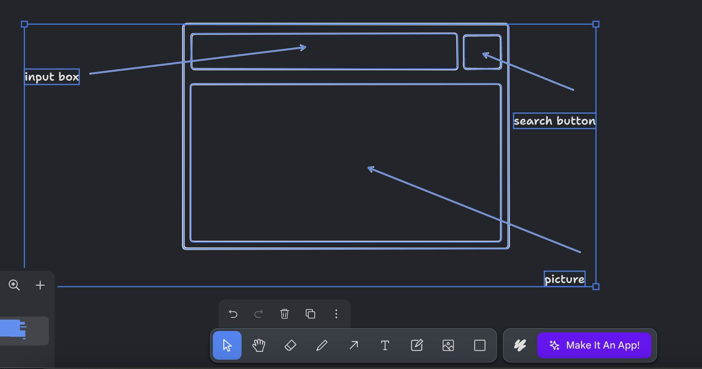
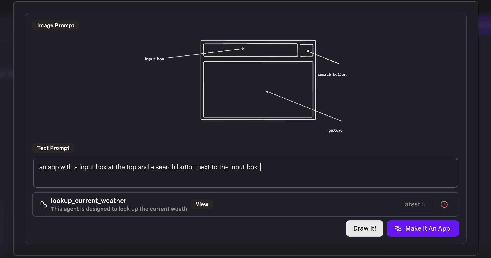
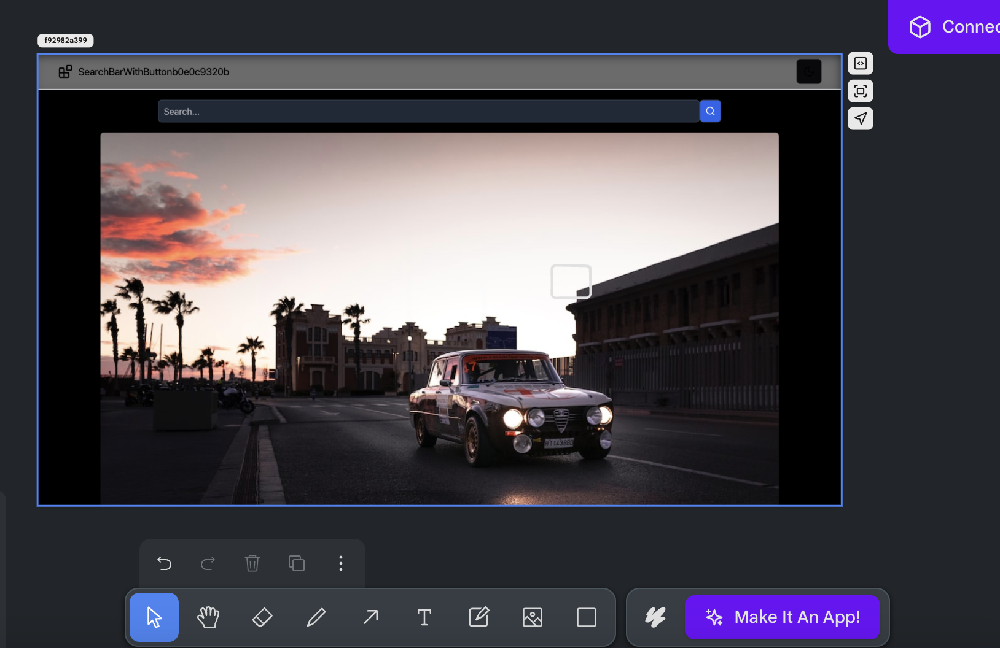
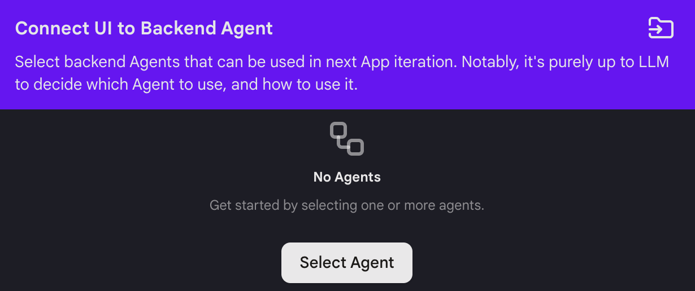
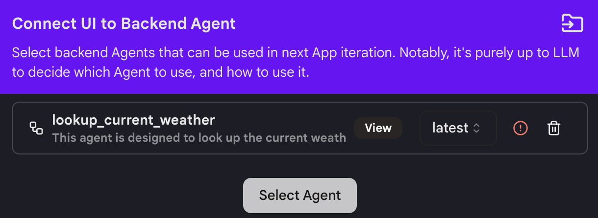
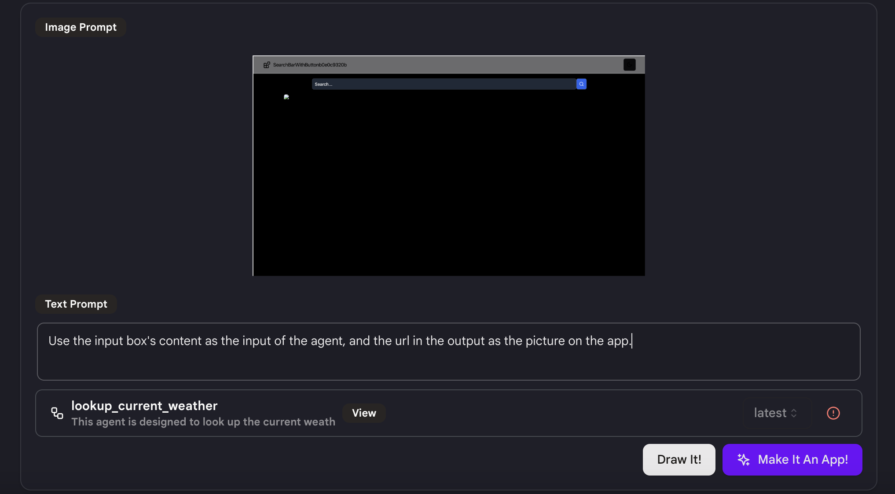

# クイックスタート

カスタマイズされたUIを使用してシンプルな天気アプリを構築する方法を説明します。

## ステップ1：アプリを作成する

* サイドバーの「マイアプリ」タブに移動し、右上の「アプリを作成」をクリックします。

* 「カスタマイズされたUI付きアプリ」を選択します。

* アプリの基本バージョンを構築するには、「イメージプロンプト」または「テキストプロンプト」を使用します。

* 「イメージプロンプト」はキャンバス上にアプリを描画するためのものです。下部のツールを使用して、アプリインターフェースの基本的な下書きを描くことができます。

<figure></figure>
  
* キャンバス上の描画を選択し、完了したら「アプリにする」ボタンをクリックします。

<figure></figure>
  
* 「テキストプロンプト」を入力して、テキストを使用してアプリをさらに説明します。

<figure></figure>

* 「アプリにする」ボタンをクリックしてアプリを構築します。

## ステップ2：アプリをデザインする

* 最初のステップが完了すると、アプリの最初のドラフトが表示されます。

<figure></figure>

* 「イメージプロンプト」または「テキストプロンプト」を使用してアプリに変更を加えることができます。これは最初のステップと同じです。

* イメージプロンプトを使用するには、ボックス、矢印、テキストを使用してキャンバス上に変更したい部分を描画します。
  
* テキストプロンプトを使用するには、「アプリにする」をクリックし、変更したい内容を説明するテキストプロンプトを入力します。

* 再度「アプリにする」をクリックすると、プロンプトに基づいて変更が加えられ、新しいバージョンのアプリが作成されます。

* **注意**：一度の試行では希望の結果が得られない場合があります。1つずつ改善し、最良の結果が得られるまで複数のバージョンを作成することをお勧めします。

## ステップ3：アプリとエージェントを接続する

* 右上の「エージェントに接続」をクリックします。

<figure></figure>

* 接続したいエージェントを選択し、バージョンを選択します。

<figure></figure>

* **注意**：エージェントの機能と入力および出力形式に精通している必要があります。エージェントがアプリに適していることを確認してください。そうしないと正常に接続できません。

* 「イメージプロンプト」または「テキストプロンプト」を使用して、エージェントをアプリでどのように使用するかを説明します。このアプリでは、入力は「ニューヨークの今の天気は？」のようなユーザーのクエリです。出力はbase64形式の画像のURLです。テキストプロンプトでは、`"入力ボックスの内容をエージェントの入力として使用し、出力のURLをアプリの画像として使用する。"`としました。

<figure></figure>

* 「アプリにする」をクリックすると、選択したエージェントと自動的にアプリが接続されます。

* **注意**：エージェントがアプリに正常に接続されるまで数回試行する必要があるかもしれません。忍耐強く取り組んでください！

* 1つのテキストプロンプトだけではアプリがエージェントに接続されないため、次に`"出力画像のURLはbase64形式です。入力ボックスの下にアプリに画像を表示します。"`を使用しました。数回の試行後、アプリは正常に動作するはずです。

## ヒント

* より良い結果を得るためには、変更したい機能や改善点を1つずつ、詳細に説明するように心がけてください。

* 現在のアプリに対して行いたい変更を伝えるために、描画ツールをうまく活用してください。

* 「アプリにする」をクリックするたびに、新しいバージョンのアプリが生成されます。結果が満足いかない場合は、以前のバージョンに戻って再度試みることができます。

これらのステップとヒントに従って、カスタマイズされたUIを使用してシンプルな天気アプリを成功裏に構築することができるでしょう。頑張ってください！