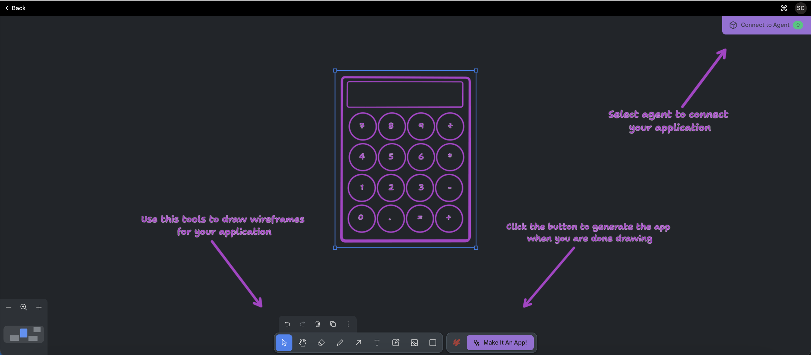
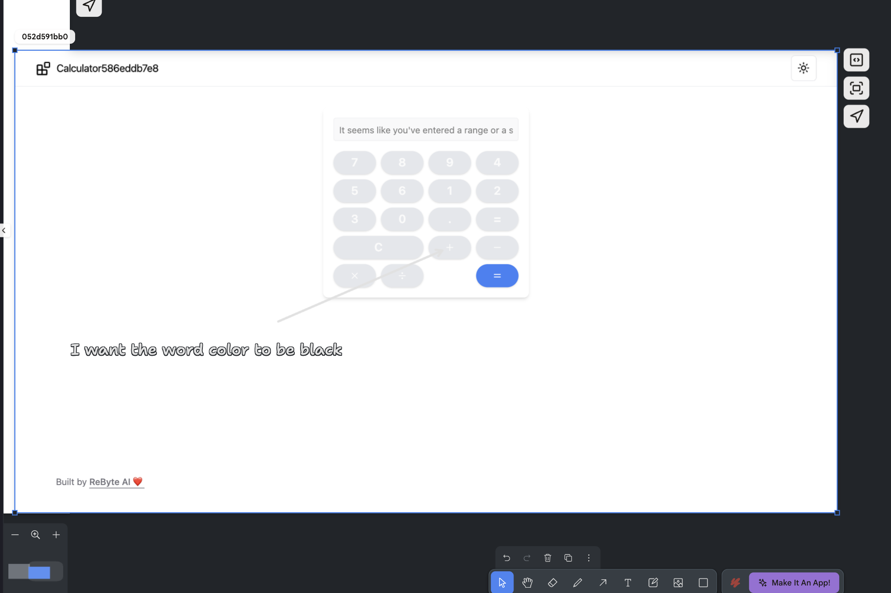
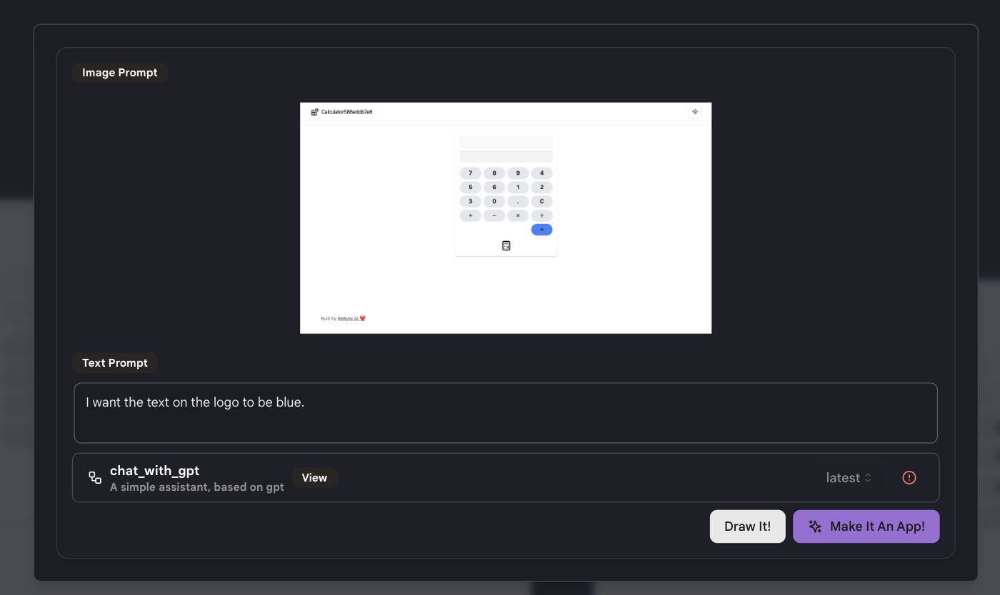
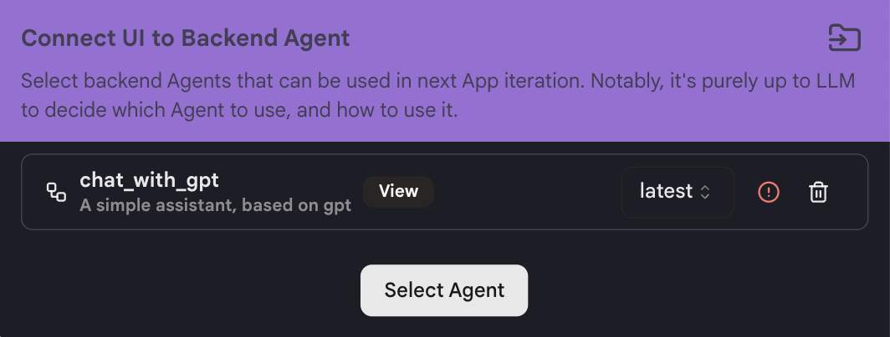
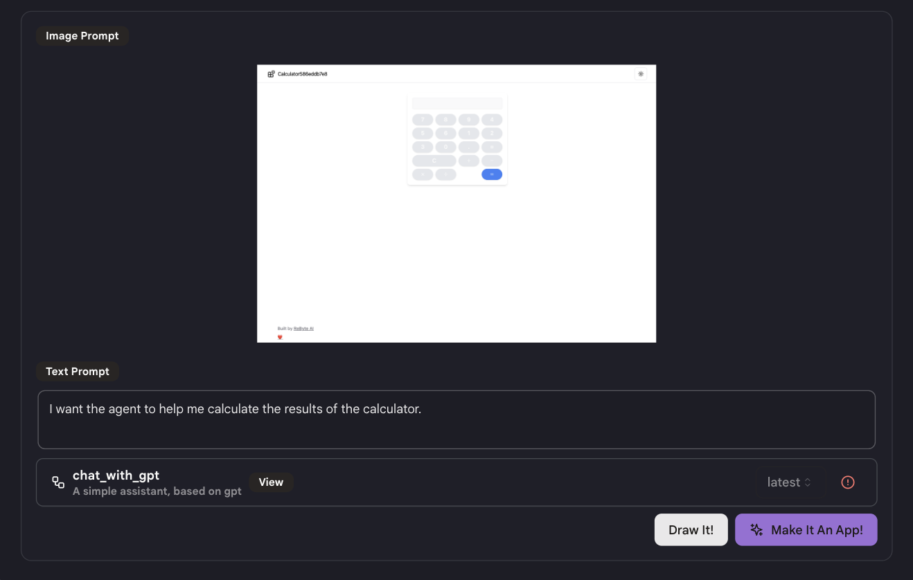

# クイックスタート

カスタマイズされたUIを使用してアプリを構築する方法を説明します。

## ステップ1：アプリを作成する

* サイドバーの「マイアプリ」タブに移動し、右上の「アプリを作成」をクリックします。

* 「カスタマイズされたUI付きアプリ」を選択します。

* このページの下部にあるツールを使用して、アプリインターフェースの基本的な下書きを描きます。

* 右下の「アプリにする」をクリックします。

<figure></figure>

* アプリに何をさせたいかを説明するテキストプロンプトを入力します。

* その後、「描く」または「アプリにする」をクリックできます。

## ステップ2：アプリをデザインする

アプリに変更を加えたい場合、次の2つの方法で変更できます：

* イメージプロンプト：キャンバス上に変更したい部分を描きます。

<figure></figure>

* テキストプロンプト：「アプリにする」をクリックし、変更したい内容を説明するテキストプロンプトを入力します。

<figure></figure>

再度「アプリにする」をクリックすると、プロンプトに基づいて変更が加えられ、新しいバージョンのアプリが作成されます。

* 注意：一度の試行では希望の結果が得られない場合があります。1つずつ改善し、最良の結果が得られるまで複数のバージョンを作成することをお勧めします。

## ステップ3：アプリとエージェントを接続する

* 右上の「エージェントに接続」をクリックし、接続したいエージェントを選択します。

* 注意：エージェントの機能に精通している必要があります。エージェントがアプリに適していることを確認してください。そうしないと正常に接続できません。

<figure></figure>

* プロンプトを使用して、エージェントをアプリでどのように使用するかを説明します。

<figure></figure>

* 「アプリにする」をクリックすると、選択したエージェントと自動的にアプリが接続されます。

## ヒント

* より良い結果を得るためには、変更したい機能や改善点を1つずつ、詳細に説明するように心がけてください。

* 現在のアプリに対して行いたい変更を伝えるために、描画ツールをうまく活用してください。

* 「アプリにする」をクリックするたびに、新しいバージョンのアプリが生成されます。結果が満足いかない場合は、以前のバージョンに戻って再度試みることができます。