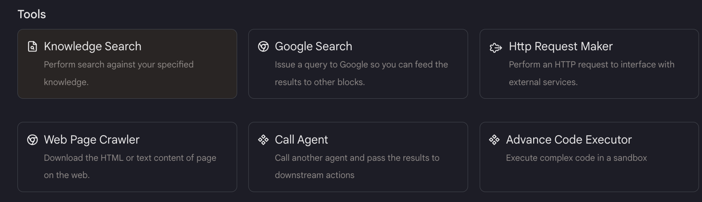
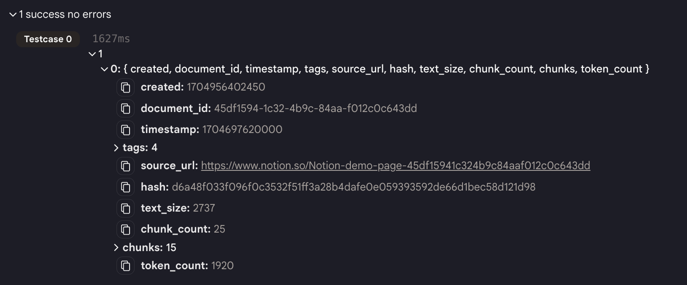
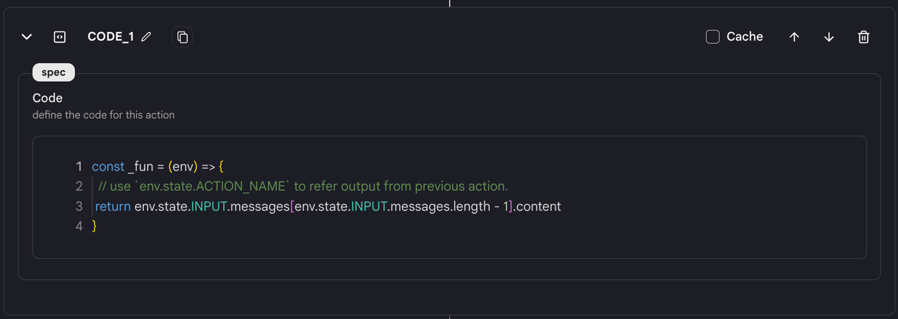
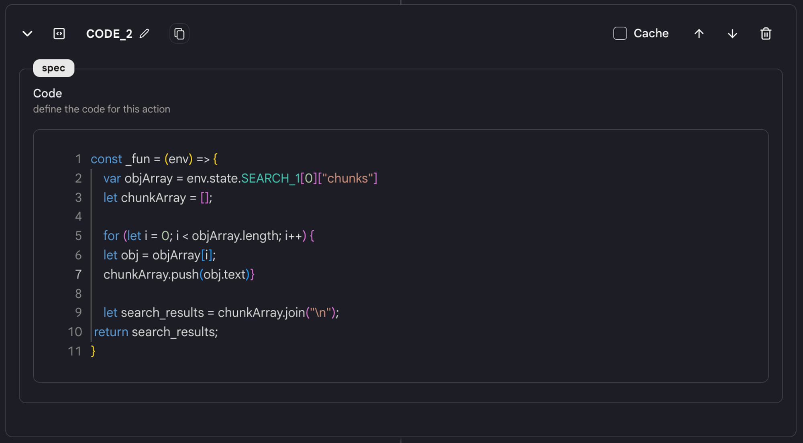
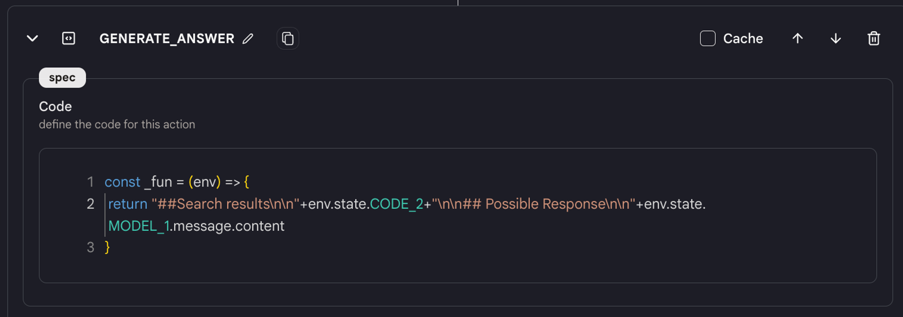
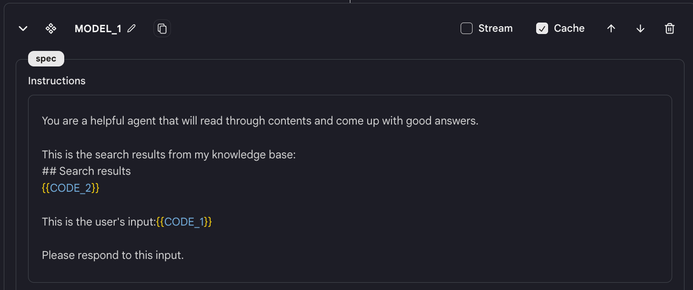

- 自動生成されたテンプレートには、すでにいくつかのアクションが作成されています。
- 異なるアクションの間にあるプラスボタンを使用して、「Knowledge Search」アクションを追加します。

<figure></figure>

- 先ほど作成したナレッジベースを選択し、結果の数を設定します。このアクションにより、指定されたナレッジベースで検索を実行し、結果を返すことができます。
- チャンク内で検索結果をすべて確認できます。

<figure></figure>

- より良い使用のために、このエージェントには3つの「コード」アクションがあります。
    - 最初のものは、最新メッセージから内容を抽出するものです。
        
        <figure></figure>
        
    - 2つ目の「コード」アクションは、「Knowledge Search」アクションの結果を連結するものです。
        
        <figure></figure>
        
    - もう1つの「Generate Answer」と呼ばれる「コード」アクションを使用して、検索結果と応答を連結します。
        
        <figure></figure>
        
- 次に、「Language Model Chat Interface」アクションを使用して、検索結果に基づいて応答を取得します。
- エディターでモデルに指示を書くことで、モデルに何をしてほしいかを記述します。モデルが応答を生成してくれます。

<figure></figure>