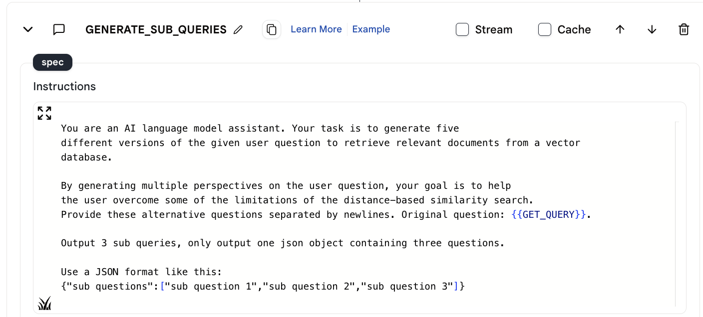
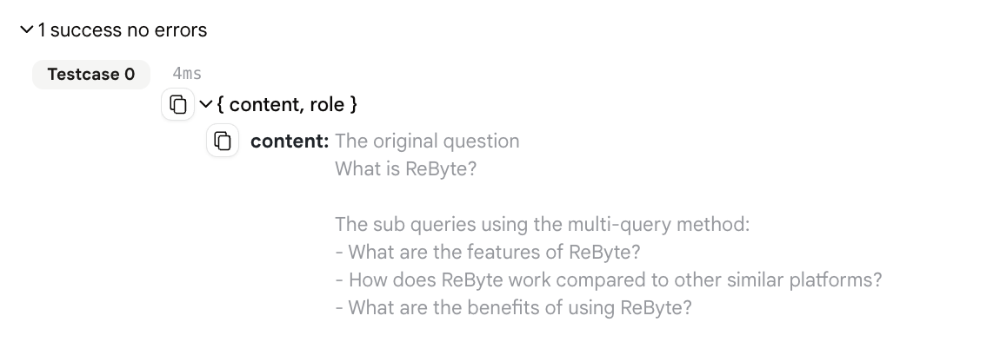
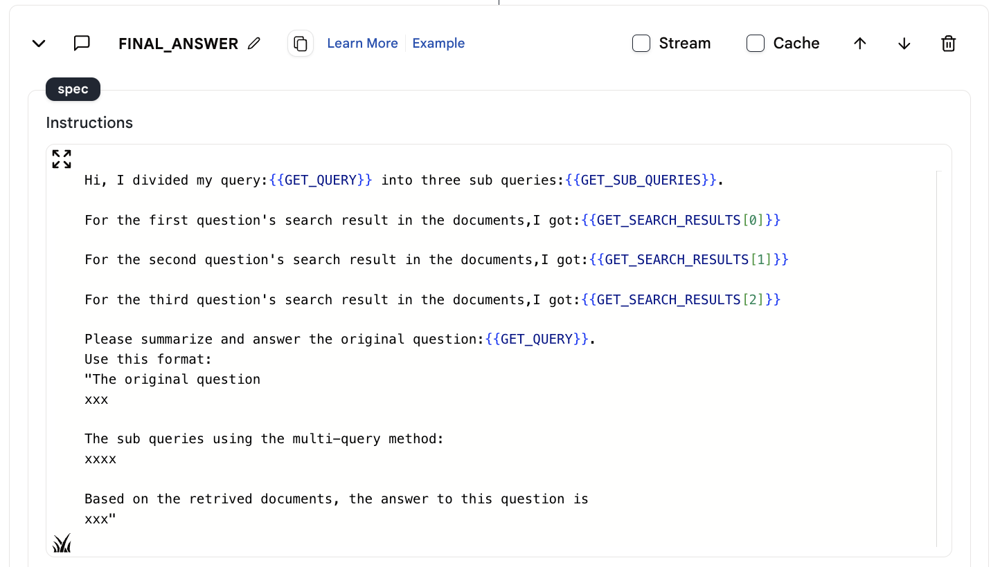
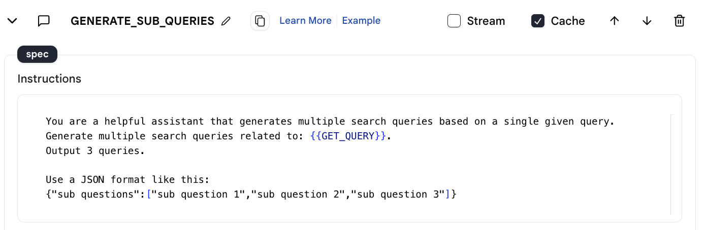
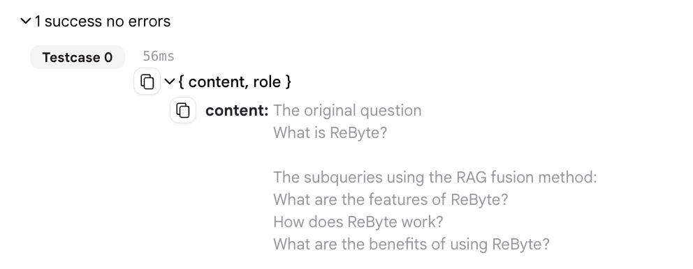
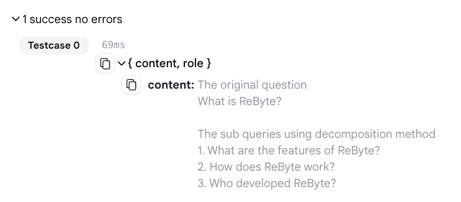
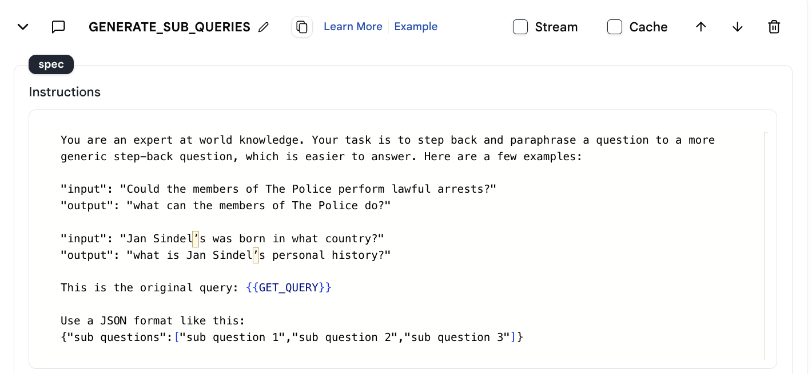
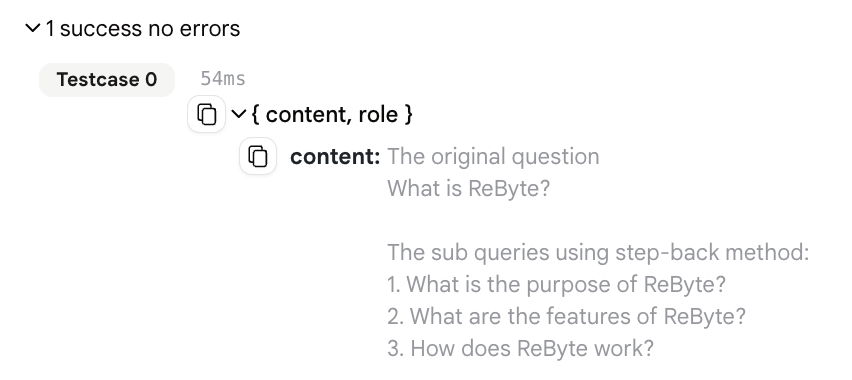

# 4 つの重要な RAG 技術ガイド

検索拡張生成（RAG）パイプラインにおけるクエリ変換技術の包括的な概要へようこそ。このシリーズでは、ユーザークエリ処理を革新する 4 つの革新的な方法、すなわちマルチクエリ変換、RAG フュージョン、分解、およびステップバックプロンプティングについて探求します。これらの技術が ReByte でどのように実装されるかを、エージェントとアプリの例を用いて示します。

## 1. マルチクエリ変換

マルチクエリ変換は、ユーザーのクエリをさまざまな形式に言い換えて多様化します。imprai では、「LLM-chat」アクションを使用して、単一のユーザークエリから複数のクエリを生成します。

以下は LLM のプロンプトです。

<figure></figure>

LLM が 3 つのサブクエリを生成します。

<figure></figure>

この技術により、各クエリバージョンがデータベース内のドキュメントと異なる形で一致する可能性があるため、関連情報を取得する可能性が高まります。

実装には、各クエリの情報を取得するために「Map-Reduce」および「ナレッジ検索」アクションを使用し、結果を要約するために別の「LLM-chat」アクションを使用します。

<figure></figure>

[マルチクエリのエージェントデモ](https://rebyte.ai/p/21b2295005587a5375d8/callable/cd26de3861da546c210f/editor)

[マルチクエリのアプリデモ](https://rebyte.ai/copilot/55f1b8fb7803c73c88d6/session/7bca7a6793)

## 2. RAG フュージョン

RAG フュージョンは、マルチクエリ変換の拡張であり、重要な相互ランクフュージョンステップを含みます。この方法は、複数のクエリからの結果を単一の最適化されたリストに統合し、包括的な情報取得に理想的です。

以下は LLM のプロンプトです。

<figure></figure>

LLM が 3 つのサブクエリを生成します。

<figure></figure>

RAG フュージョンは、imprai でマルチクエリを生成し、ドキュメントを取得する同様のプロセスで示されます。

[RAG フュージョンのエージェントデモ](https://rebyte.ai/p/21b2295005587a5375d8/callable/103ce69a89b657efdfc0/editor)

[RAG フュージョンのアプリデモ](https://rebyte.ai/copilot/1583ecb2733c95dea108/session/8ccc51d47f)

## 3. 分解

分解は、複雑なクエリを小さなサブクエリに分解し、それぞれ独立して解決します。imprai で示されるこのアプローチは、取得プロセスを簡素化し、詳細な応答を可能にします。

以下は LLM のプロンプトです。

<figure></figure>

LLM が 3 つのサブクエリを生成します。

<figure></figure>

ここでは、「LLM-chat」アクションを使用してサブクエリを生成し、それらを処理して包括的な回答を形成します。

[分解のエージェントデモ](https://rebyte.ai/p/21b2295005587a5375d8/callable/99a7ce76993d93a43411/editor)

[分解のアプリデモ](https://rebyte.ai/copilot/55f1b8fb7803c73c88d6/session/7bca7a6793)

## 4. ステップバックプロンプティング

ステップバックプロンプティングは、特定のクエリをより一般的なものに抽象化し、情報取得の範囲を広げます。imprai では、この方法により特定のクエリから高レベルの質問を生成し、関連情報の幅広い取得を促進します。

以下は LLM のプロンプトです。

<figure></figure>

LLM が 3 つのより一般的なクエリを生成します。

<figure></figure>

この技術は、クエリの具体的な詳細と同様に、バックグラウンド情報が重要な文脈で特に効果を発揮します。

[ステップバックプロンプティングのエージェントデモ](https://rebyte.ai/p/21b2295005587a5375d8/callable/069845d6d867c11ef32d/editor)

[ステップバックプロンプティングのアプリデモ](https://rebyte.ai/copilot/f527fbc4eca2d3fe326f/session/1dd77d8bd5)

## 結論

これらのクエリ変換技術は、RAG システムにおいて正確で関連性の高い包括的な情報取得を確保するための強力なツールキットを形成します。マルチクエリ変換および RAG フュージョンは検索範囲を拡大し、分解は複雑なクエリを簡素化し、ステップバックプロンプティングはクエリをより抽象的なレベルに引き上げます。クエリ変換と RAG パイプラインにおけるさらなる洞察と進展を期待してください。
