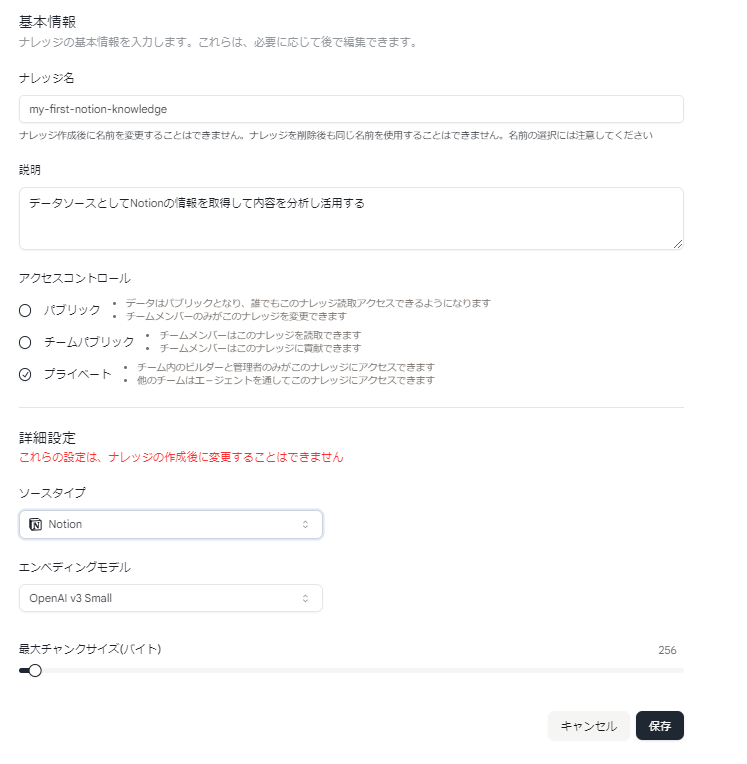
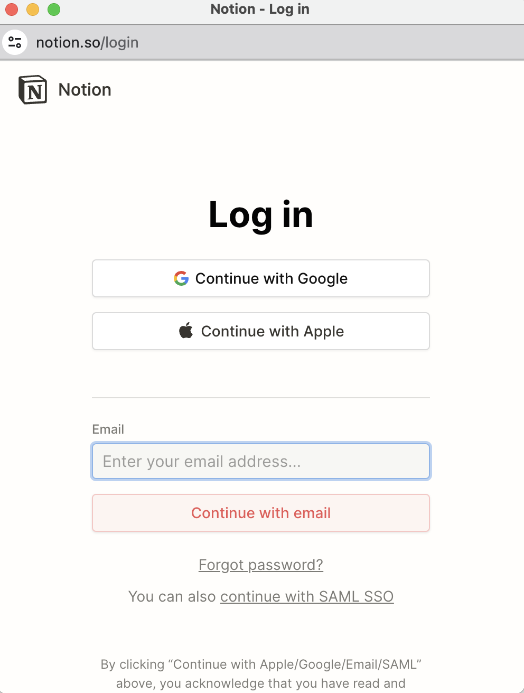
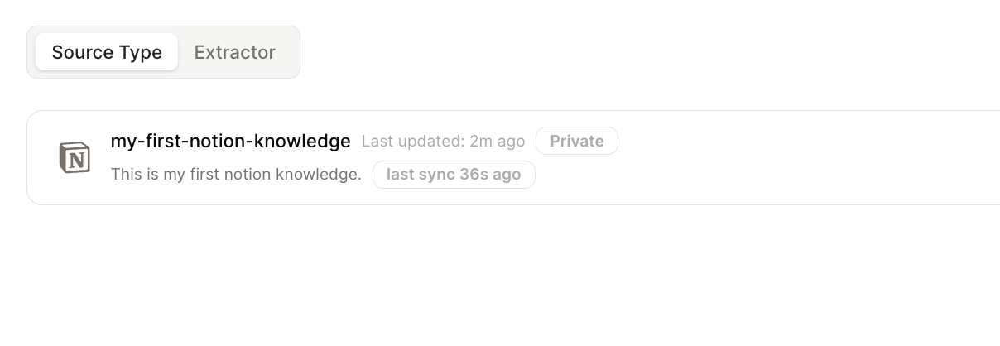

# ナレッジタイプ

多くのデータソースがサポートされています。これにはローカルファイル、Notion、Github、Discord などが含まれます。

## ローカルファイル

ファイルをアップロードしてナレッジに保存できます。

サポートされるファイルタイプ：DOC、DOCX、IMG、EPUB、JPEG、JPG、PNG、XLS、XLSX、PPT、PPTX、MD、TXT、RTF、MD、RTF、RST、PDF、JSON、HTML、EML

## Notion

Notion アカウントを接続し、Notion ページをナレッジにインポートできます。

- ナレッジのデータソースとして Notion を選択します。

<figure></figure>

- ポップアップページで Notion アカウントにログインし、ナレッジにインポートしたいページを選択します。

<figure></figure>

- Notion と同期し、コンテンツがタイムリーに更新されるようにします。

<figure></figure>

<!-- ## Github

## Discord -->
