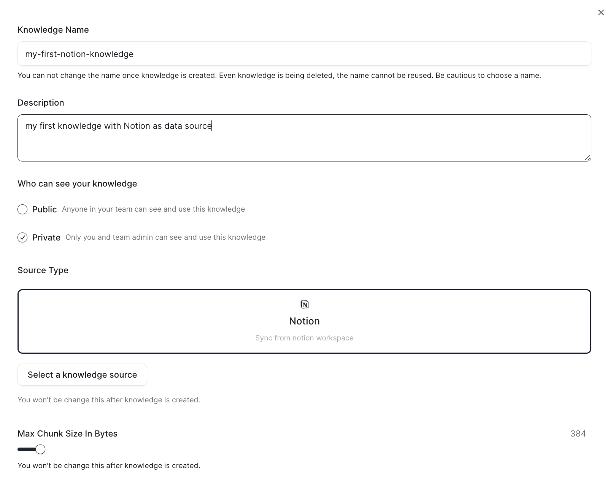

# ナレッジタイプ

多くのデータソースがサポートされています。これにはローカルファイル、Notion、Github、Discordなどが含まれます。

## ローカルファイル

ファイルをアップロードしてナレッジに保存できます。

サポートされるファイルタイプ：DOC、DOCX、IMG、EPUB、JPEG、JPG、PNG、XLS、XLSX、PPT、PPTX、MD、TXT、RTF、MD、TXT、RTF、RST、PDF、JSON、HTML、EML

## Notion

Notionアカウントを接続し、Notionページをナレッジにインポートできます。

* ナレッジのデータソースとしてNotionを選択します。

<figure></figure>

* ポップアップページでNotionアカウントにログインし、ナレッジにインポートしたいページを選択します。

<figure></figure>

* Notionと同期し、コンテンツがタイムリーに更新されるようにします。

<figure></figure>

<!-- ## Github

## Discord -->