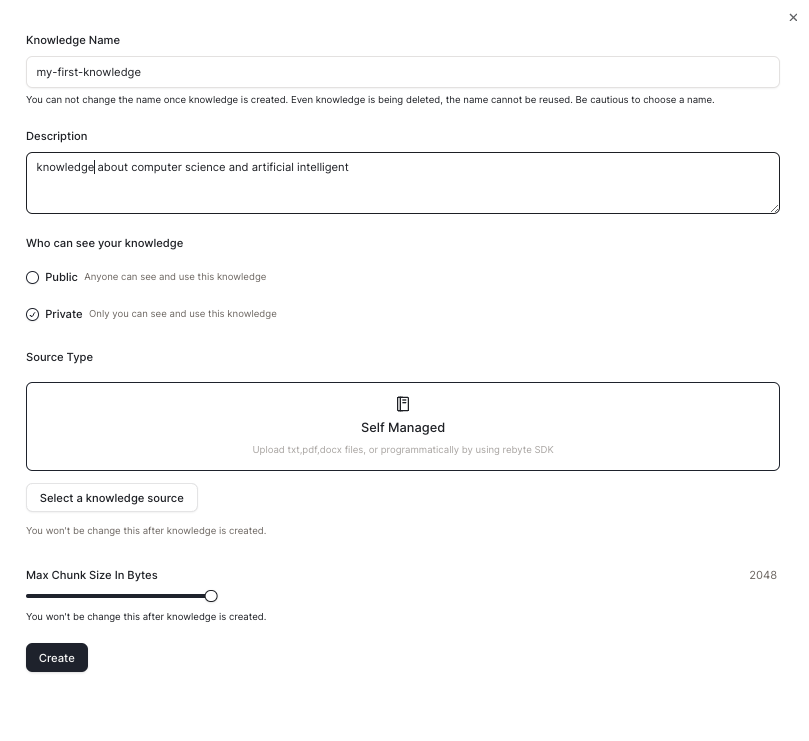
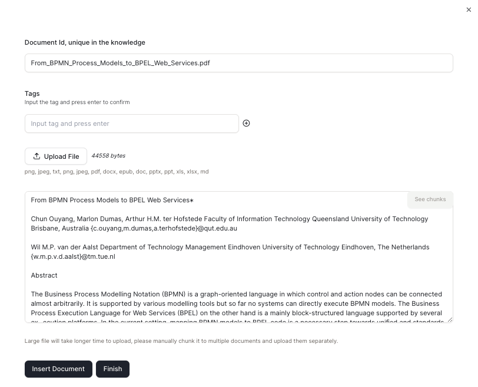
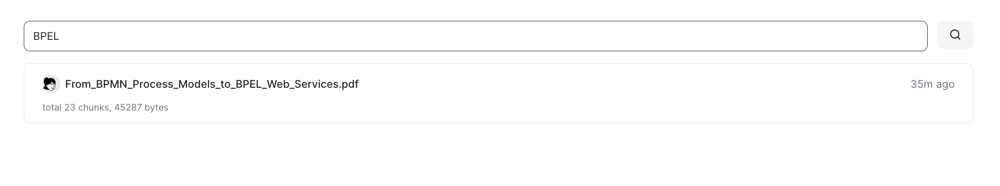
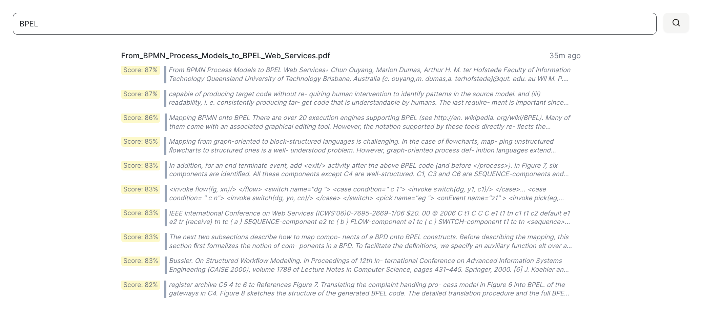
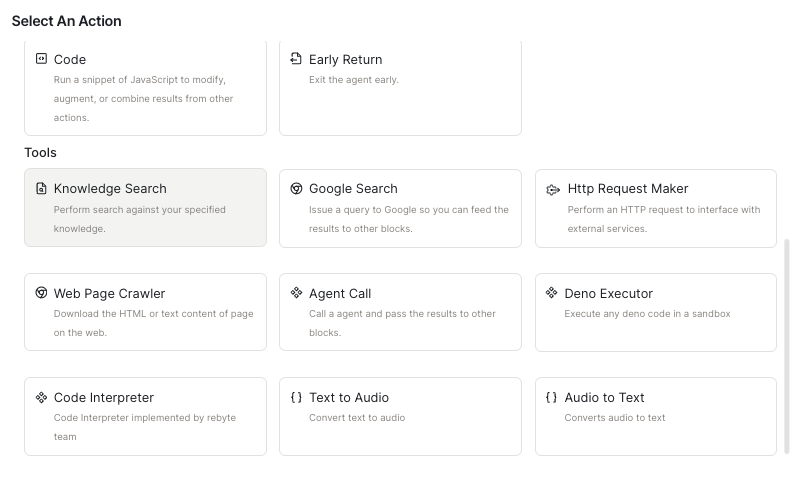
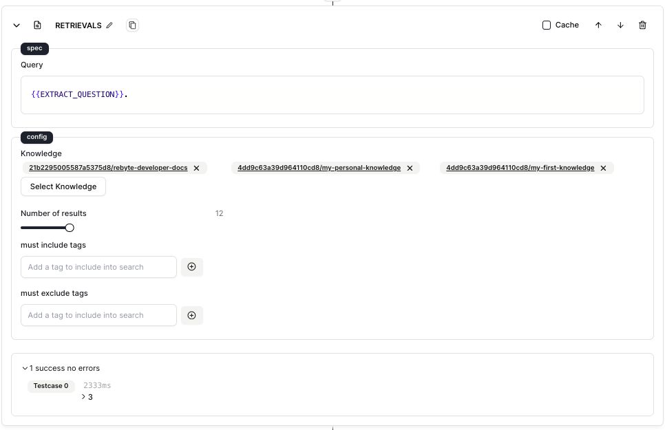

# Quick Start

Welcome! We tell you now to create and use knowledge.

## Step 1: Create Knowledge

* Navigate to the "Knowledge" tab in the sidebar and then click on "Create Knowledge".

* Fill in the knowledge information and choose the source type for your knowledge. Here we choose "Self Managed" since we are going to use local files.

<figure></figure>

## Step 2: Upload Files

* Click "Upload File" and upload your local file, once uploaded, we will generate a unique document id for your file.

* Click "Insert Document" to upload this file.

<figure></figure>

**Now you have created your first knowledge!**

## Step 3: Use Your Knowledge

* You can search knowledge in the **search box** and hit enter. 

<figure></figure>

<figure><figcaption>Search Results</figcaption></figure>

Or you can use the knowledge in your **agent**. 

## Step 4: Use Knowledge in Agent

* Use "Search Knowledge" actions and choose the knowledge you want to use.

<figure><figcaption>Search Results</figcaption></figure>

* You can fill in the query to the knowledge search and set the number of results.

<figure></figure>

