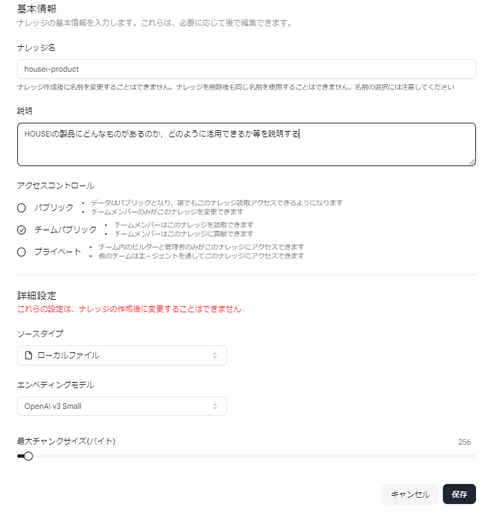
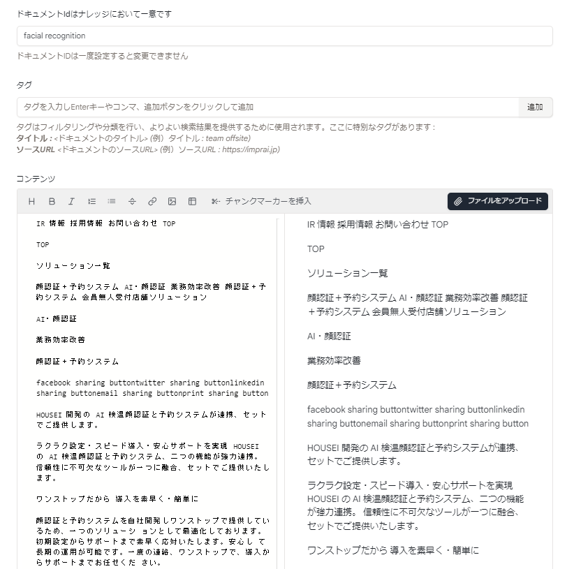
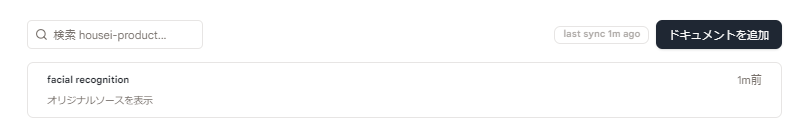
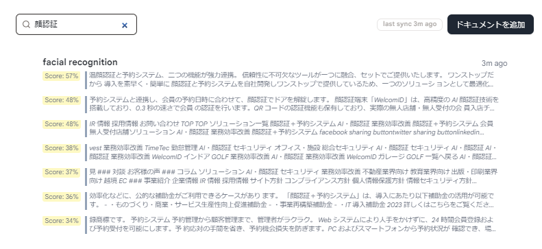
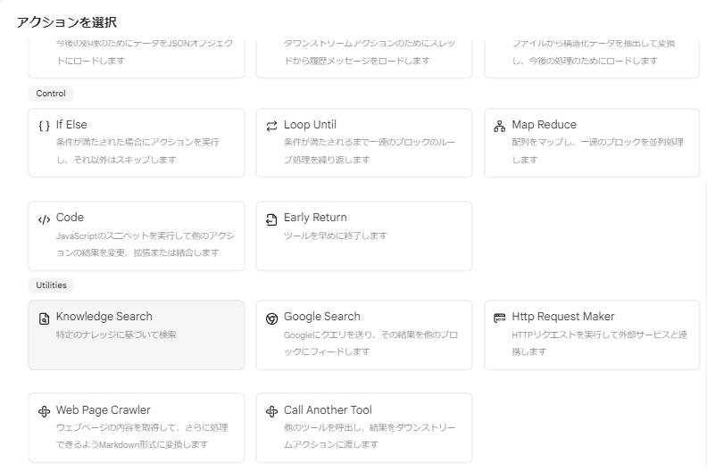
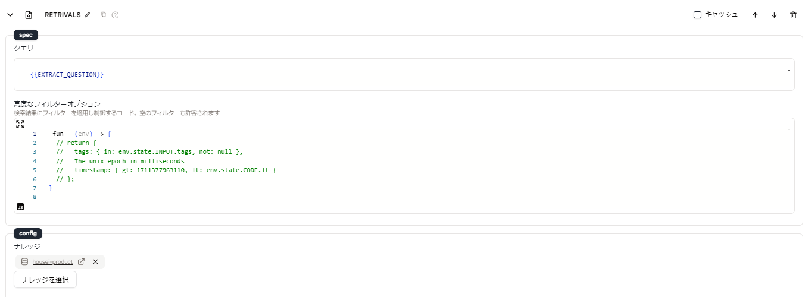

# クイックスタート

ここでは、ナレッジを作成し使用する方法を説明します。

## ステップ 1: ナレッジを作成する

- サイドバーの「ナレッジ」タブに移動し、「ナレッジを作成」をクリックします。

- ナレッジ情報を入力し、ナレッジのソースタイプを選択します。ここではローカルファイルを使用するため、「ローカルファイル」を選択します。

<figure></figure>

## ステップ 2: ファイルをアップロードする

- ドキュメント ID を設定します

- 「ファイルをアップロード」をクリックし、ローカルファイルをアップロードします。

<!-- - アップロードが完了すると、ファイルに一意のドキュメント ID が生成されます。 -->

- 「保存」をクリックします。

<figure></figure>

**これで最初のナレッジが作成されました！**

## ステップ 3: ナレッジを使用する

- **検索ボックス**でナレッジを検索し、ENTER キーを押します。

<figure></figure>

<figure><figcaption>検索結果</figcaption></figure>

または、**ツール**でナレッジを使用することもできます（ステップ 4 で説明）。

## ステップ 4: ツールでナレッジを使用する

- 「ナレッジを検索」アクションを使用し、使用するナレッジを選択します。

<figure><figcaption>検索結果</figcaption></figure>

- ナレッジ検索にクエリを入力し、取得したいクエリ結果の数を設定できます。

<figure></figure>

- 結果は「ナレッジ」ページでの検索と同じです。
