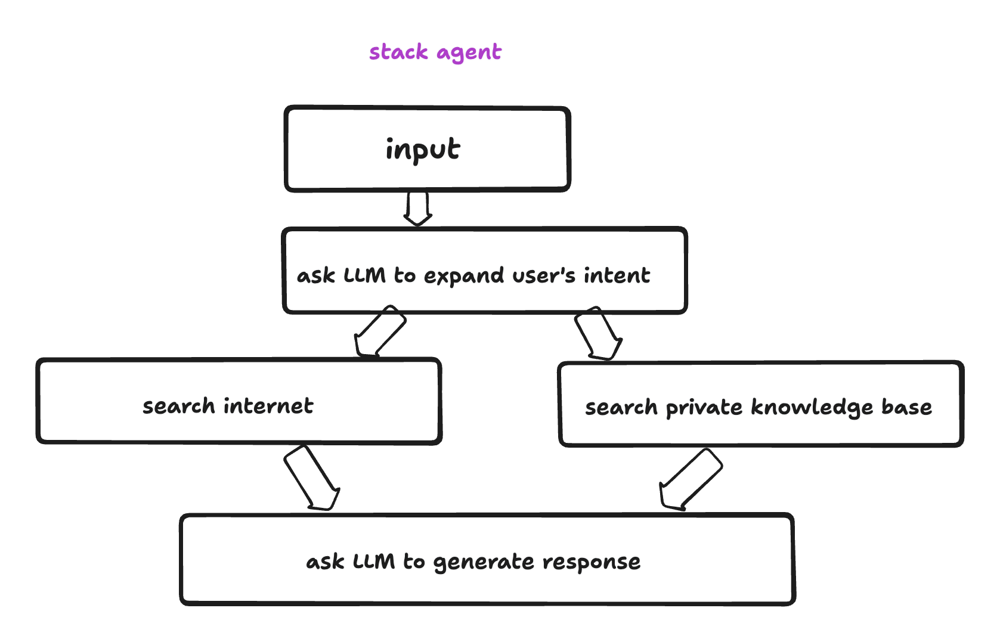

# ツールとナレッジ

## ツール

> アシスタントのバックエンドサブルーチン

imprai では、ツールをクラウド上で実行できるサーバーレス API として定義します。通常、ツールは AI モデルを活用していくつかのタスクを実行し、その知能を発揮しますが、これは必須ではありません。AI モデルを使用しないツールは通常のサーバーレス API と同様ですが、ここでは AI ツールに焦点を当てます。

以下は AI ツールの典型的な例です：

- ユーザーのクエリに基づいて、ユーザーのナレッジベースから最も関連性の高い情報を見つけ出し、その結果を要約してユーザーに返す
- ユーザーが自然言語でデータベースクエリを説明し、ツールがそのクエリを SQL に翻訳してユーザーのデータベース上で実行し、その結果を要約してユーザーに返す
- ユーザーが自然言語で翻訳タスクを説明し、ツールは翻訳を実行しかつ翻訳の品質を評価します。品質が十分でない場合は品質が十分になるまで翻訳プロセスを繰返す

### 典型的なツールワークフロー

<figure><figcaption></figcaption></figure>

- ツールは、LLM サーバーレスランタイム上で実行できる一連のアクションです。これは imprai のコアとなる構成要素であり、エンドユーザーが自分のツールを作成するための主な方法です。imprai はエンドユーザーが自分の LLM ツールを作成や編集するための GUI ビルダーを提供します。また、一般的なユースケースのための事前構築されたアクションのリストも提供しており、ソフトウェアエンジニアが独自のアクションを構築し、ツールビルダーとシームレスに統合するためのプライベート SDK も提供しています。事前構築されたアクションには以下が含まれます：

  - LLM アクション
    <!-- - 言語モデルコンプリートインターフェース -->
    - 言語モデルチャットインターフェース
  - データアクション
    - データセットローダー : 後で処理するための事前定義されたデータセットをロード
    - ファイルローダー : ユーザー提供のファイルを抽出/変換/ロード
    - セマンティック検索 : ユーザーのナレッジベース上で類似のコンテンツを検索
  - ツールアクション
    - 検索エンジン : Google や Bing で情報を検索
    - ウェブクローラー : ウェブページをクロールして情報を抽出
    - Http リクエストメーカー : 任意の公開、非公開 API に http リクエストを送信
  - 制御フローアクション
    - ループ処理 : 条件が満たされるまでループして実行
    - 並列処理 : 複数のアクションを並行して実行
    - バニラ Javascript : 任意のバニラ Javascript コードを実行（純粋なデータ変換に便利）

## ナレッジ - プライベートデータの取得

> アシスタントのための要素

- ナレッジは imprai が管理するベクトルデータベースに保存されるプライベートデータです。imprai は現在、エンドユーザーがナレッジをインポートするための次のコネクタを提供しています：
  - ローカルファイル、サポートされるファイルタイプは以下の通りです：
    - doc, docx, img, epub, jpeg, jpg, png, xls, xlsx, ppt, pptx, md, txt, rtf, rst, pdf, json, html
  - Notion
  - Discord
  - GitHub
  - その他のコネクタも近日中に提供予定
  - ナレッジは、LLM ツールにおいてセマンティック検索やデータ拡張に使用できます。優れた例として、ナレッジを活用してユーザーのプライベートナレッジベース上でセマンティック検索を行い、その検索結果を用いて言語モデルのデータ拡張を行う、いわゆる**検索拡張生成（Retrieval Augmented Generation, RAG）**があります。
