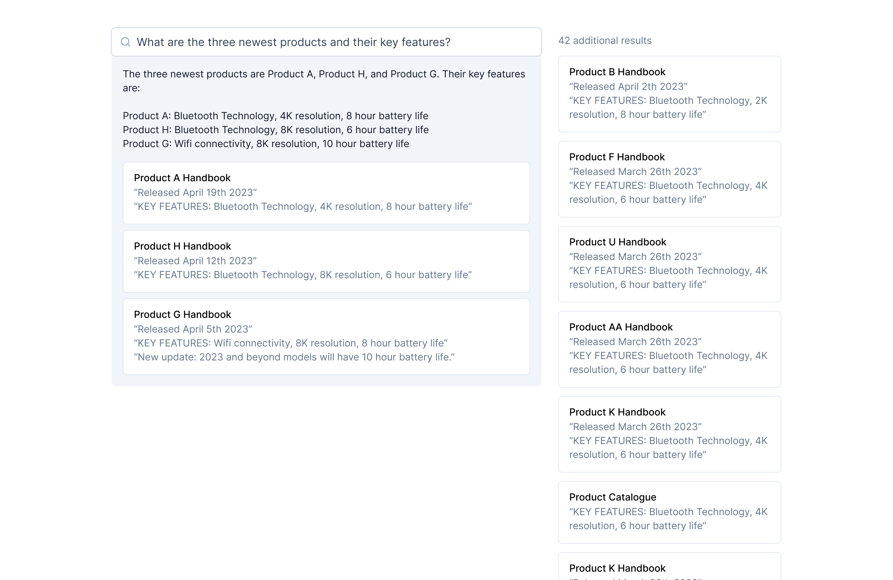

# 🛫 Making your first Copilot

Copilots are UI-based AI assistants that are designed for **non-developers** to create their own customizable AI assistants. This tutorial guides you through the process!

## 1. Create a knowledge

One of the powerful features of Cortex is to let AI interact with your own data. Knowledge is where you store your data.&#x20;

Head to the knowledge tab here and create a knowledge

<figure><figcaption></figcaption></figure>

Cortex supports multiple upload options. You can directly upload your pdf, or Word doc, give the URLs of a particular website or connect with third-party applications like Notion and Slack, and we will sync up the knowledge automatically.&#x20;

<figure><figcaption></figcaption></figure>

If you want to learn more about how knowledge works. Go to [knowledge.md](../fundamentals/knowledge.md "mention")

Navigate through the rest of the Knowledge setup process, and you will have your first knowledge ready!&#x20;

<figure><figcaption></figcaption></figure>


Give the knowledge upload process a few minutes to fully sync up. You can continue to the next step, the sync up process will continue to run in the background.


## 2. Create Copilot

Head to the Copilots tab and click Create Copilot

<figure><figcaption></figcaption></figure>

### General Setting and Permissions

Give your copilot a name and a clear description, and configure the access levels of your copilots

<figure><figcaption></figcaption></figure>

* **Public:** your copilot will be available to anyone on the internet with the copilot link to use. It might also show up on the Discover page&#x20;
* **Private:** your copilot is only visible to you and the people you invited
* **Unlisted:** your copilot will be available to anyone on the internet with the copilot link to use. It won't show up on the Discover page or search engines &#x20;

### Configure UI & Callable&#x20;

#### Select UI

Choose which type of UI you'd like your copilots to have. Let's choose Chat UI.&#x20;

<figure><figcaption></figcaption></figure>

<figure><figcaption>
Chat UI looks like this
</figcaption></figure>

#### Configure Callable

Callable is what's powering the Copilots UI. We have a list of pre-built Callable for you to choose from. Pick the one that best fits your use case. If you or your organization have built your own Callable, it will also show up here for you to choose.

<figure><figcaption></figcaption></figure>

select latest version to receive continuous updates

.png>)

select my-notion-workspace that we've just created earlier..png>)

### Give examples

Give a few examples of how you could use your copilot. This will help your users to understand what your assistants are capable of. For example, for a chat copilot about Notion QA, you can put: "Where is the PRD for the product landing page?"

<figure><figcaption></figcaption></figure>

After clicking + Create Copilot button, your copilot will be available for you to use! You can share this copilot via the URL.&#x20;
